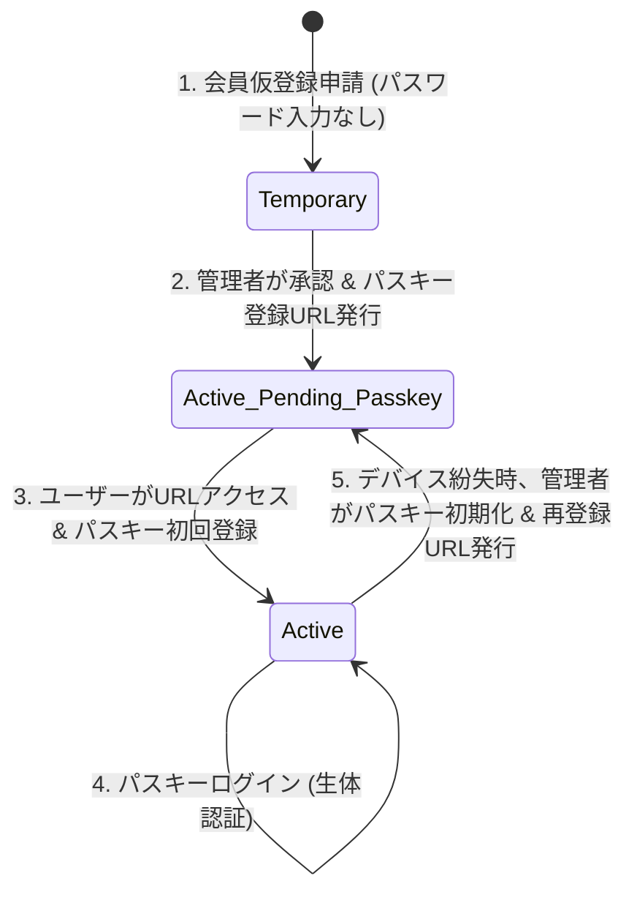
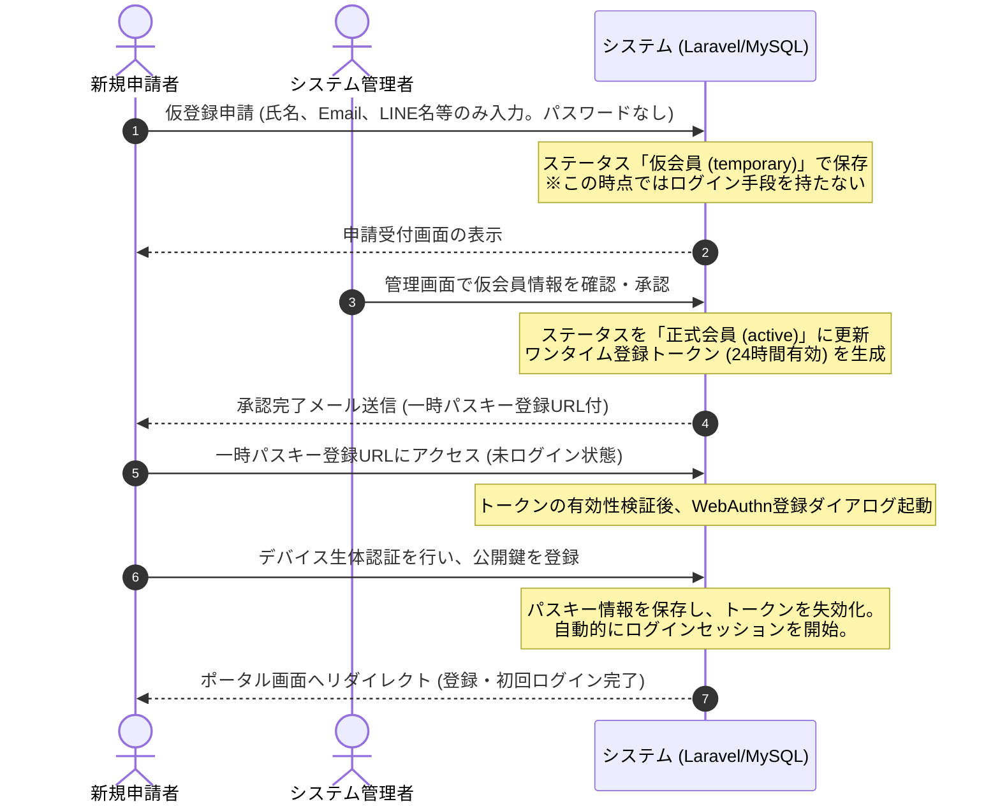

# 完全パスレス（パスキー専用）認証・ユーザー管理機能仕様書

## 1. 背景と目的
本システムでは、パスワード漏洩、リスト型攻撃、フィッシングによる不正アクセスリスクを根絶し、ユーザーの利便性を最大化するため、**従来のパスワード認証およびパスワード設定プロセスを完全に排除**し、**パスキー（Passkey / WebAuthn）に特化した完全パスレス認証**へ移行する。

従来の「パスキー優先・パスワード併用」モデルから、パスワードの入力を一切伴わない「パスキー専用」の会員登録・承認・ログインライフサイクルを定義する。

---

## 2. 全体アーキテクチャとライフサイクル

ユーザーのアカウントライフサイクルは以下のフローをたどる。



### 2.1 会員登録申請から初回ログインまでのシーケンス



---

## 3. 各フェーズの詳細仕様

### 3.1 会員仮登録申請フォーム（外部公開）
未ログインの利用者が会員申請を行う。
- **入力項目**: 氏名（漢字/かな）、メールアドレス、本業・職業、所属団体、LINEアカウント名など（※パスワード入力は求めない）。
- **バックエンド処理**: ステータスを「仮会員（`temporary`）」としてデータベースに保存する。この状態では、まだパスキーが未登録のためシステムへはログインできない。

### 3.2 管理者による会員承認と登録URL発行（メール送信）
管理者が「仮会員」の情報を確認し、正式に承認する。
- **バックエンド処理**:
  - ステータスを「正式会員（`active`）」に更新する。
  - 暗号論的に安全な「一時登録トークン」（有効期限24時間）を生成しデータベースに保存する。
  - 承認完了と一時登録URL（トークン付）を含んだ「パスキー登録のお願い」メールを自動送信する。
- **一時登録URLの形式**: `https://www.syukuba.home/passkey/register/initiate?token={one_time_token}`

### 3.3 パスキー初回登録処理（ワンタイムトークン検証）
一時登録URL（メールに記載）にユーザーがアクセスした際の挙動。
1. **トークンの検証**: サーバー側でトークンの有効性（未登録・期限内）を検証し、一致すれば登録画面を表示する。
2. **WebAuthnの実行**: ユーザーが「パスキーを登録する」ボタンを押すと、ブラウザ経由でデバイスの生体認証（指紋・顔認証・PIN）を起動し、公開鍵をサーバーに送信・登録する。
3. **自動ログイン（オートイン）**: パスキー登録が成功すると、サーバー側でトークンを即座に失効化し、当該ユーザーの認証セッションを開始（ログイン状態へ移行）した上で、システムポータル画面へ遷移させる。

---

## 4. ログイン機能の仕様（パスキー専用）

### 4.1 ログイン画面の挙動とユーザーインターフェース
- **画面要素**:
  - メールアドレス入力欄のみを配置する。**パスワード入力欄は一切表示しない。**
  - ブラウザのオートフィル（Conditional UI）を有効化し、メールアドレス欄フォーカス時に登録済みのパスキー候補をキーボード上部等に提案する。
- **ログインの流れ**:
  1. **Conditional UIでのログイン**: オートフィル候補を選択して生体認証を通すだけで即座にログイン完了。
  2. **手動入力でのログイン**: メールアドレスを入力して「ログイン」ボタンを押下。
     - 登録済みのパスキーが存在する場合: ブラウザの WebAuthn 認証ダイアログを自動起動し、生体認証を促す。
     - 登録済みのパスキーが存在しない場合: 画面にエラーメッセージを表示する（「パスキーが登録されていません。管理者にパスキー登録URLの発行を依頼してください」）。

---

## 5. パスキー登録用URL発行（Artisanコマンド仕様）

初期データベースシーダーの実行後や、緊急時にサーバーのコンソール（SSH経由）から直接パスキー登録用URLを発行するため、以下のArtisanコマンドを提供する。

### 5.1 一般・管理者共通パスキー発行/リセットコマンド
- **コマンド名**: `php artisan passkey:issue-url`
- **引数・オプション**:
  - `--email` (必須) : 対象ユーザーのメールアドレス
- **コマンドの実行プロセス**:
  1. 指定されたメールアドレスのユーザーが `comittee_users` に存在するか検索する。
  2. **ユーザーが存在しない場合**:
     - エラー「指定されたメールアドレスのユーザーが存在しません。先にシステムへユーザーを登録してください。」を出力し、異常終了する。
  3. **ユーザーが存在する場合**:
     - **既存パスキーのクリア**: 当該ユーザーに紐づく既存のパスキー情報（登録済み資格情報）がデータベースに存在する場合、すべて物理削除（リセット）する。
     - **権限の維持**: 管理者を含むいかなるユーザーであっても、ロール（`roles`）や会員種別などの権限変更は一切行わない（シーダーや管理画面によってすでに付与されているロールがそのまま維持される）。
  4. 対象ユーザー用に安全なワンタイム登録トークン（有効期限24時間）を発行し、データベースに保存する。
  5. ターミナルに以下のような登録用URLを出力する。
     ```bash
     パスキー登録用URLの発行に成功しました（既存のパスキーはリセットされました）。
     以下のURLにブラウザでアクセスし、パスキーの登録を行ってください（有効期限: 24時間）。
     
     https://www.syukuba.home/passkey/register/initiate?token=4f9e6a7c...
     ```

---

## 6. デバイス紛失時のリカバリー設計（管理者制御型）

パスワード認証が存在しないため、デバイス紛失時は管理者による完全リセットが必須となる。

1. **紛失申請と一時無効化**:
   - ユーザーは別の手段（LINEや電話等）でシステム管理者にデバイス紛失を申告する。
   - 管理者は管理画面の会員詳細から、該当ユーザー of 登録済みパスキー（資格情報）を削除（無効化）する。
2. **再登録セッションの発行**:
   - 管理者は「パスキー再登録URLを発行」ボタンを押下する。
   - システムは新しいワンタイムトークンを生成し、メールまたは管理画面上に再登録URLを表示する。
   - ユーザーが新しいデバイスからそのURLにアクセスし、新規パスキーを登録することで復旧する。

---

## 7. マルチデバイス同期と複数デバイス登録の運用方針（ユーザー周知）

パスキー専用認証への移行に伴い、複数のデバイス（PCとスマートフォンなど）でシステムを利用するユーザーへの案内および運用について、以下の内容を周知・設計する。

### 7.1 同一OSエコシステム内での自動同期 (Synced Passkeys)
- **概要**:
  同一のOSアカウント（Apple ID、Google アカウント、Microsoft アカウント）を使用しているデバイス同士であれば、クラウド経由でパスキー（Synced Passkeys）が自動同期される。
- **周知・説明方針**:
  - 例: iPhoneでパスキーを初回登録した場合、同じApple IDを使用するMacBookやiPadでは、追加の登録作業なしで即座にログインが可能。
  - AndroidとChrome OS、Windowsデバイス（Microsoftアカウント同期時）の間でも同様の自動同期が行われる。

### 7.2 クロスプラットフォーム（異なるOS間）での利用
- **ハイブリッド認証の案内**:
  - 同期されていないPC（例: 会社のWindows PC）でログインする際、一時的な手段として「スマートフォンを使用した認証」が利用可能。
  - ログイン画面に表示されるQRコードをスマホのカメラでスキャンし、Bluetooth/Wi-Fi通信を通じてスマートフォンの生体認証を利用してPC側でログインする。
- **複数デバイスの個別登録**:
  - 常用する複数の異なるエコシステムのデバイス（個人のMacと仕事用のWindows等）が存在する場合、それぞれの端末に対してパスキーを個別登録することを推奨する。
  - 本システムではセキュリティポリシー上、ユーザーがセルフサービスでパスキーを追加登録する画面は提供しない。そのため、別端末での個別登録を希望するユーザーに対しては、管理者が「パスキー再登録（追加）用URL」を発行して登録手続きを行う。

---

## 8. データベース設計の変更点

### 8.1 会員テーブル (`comittee_users`) のカラム変更
- **`password` カラムの削除**:
  パスワード情報を一切保持しないため、`password` カラムをテーブルから物理削除する（またはNullableにして使用停止とするが、完全排除のためマイグレーションによる物理削除を推奨）。
- **`status` カラムの追加状態**:
  仮登録申請時は `temporary`（仮会員）のままとする。

---

## 9. 改訂履歴
- 2026-07-11: 完全パスレス（パスキー専用）認証仕様の策定（新規作成・初版）
- 2026-07-11: マルチデバイス同期および複数デバイス登録に関するユーザー周知・運用仕様を追記
- 2026-07-11: 登録コマンドを `passkey:issue-url` に一本化し、シーダー実行後の初期設定に対応
