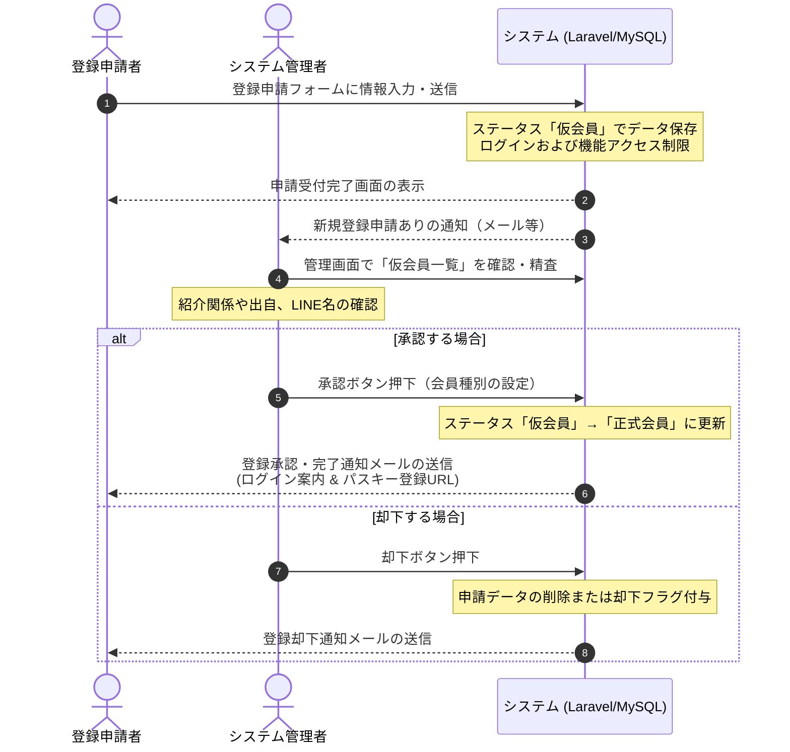

# 保土ケ谷宿場まつり実行委員会 実務管理総合システム ユーザー登録機能仕様書

本書は、システム仕様書（[system_specifications.md](../system_common/system_specifications.md)）および機能詳細設計書（[functional_details.md](../system_common/functional_details.md)）に基づき、新規会員の「自主登録申請（仮登録）」から「システム管理者による承認」「正式会員への移行」までのフローおよび技術的な詳細仕様を定義する。

---

## 1. ユーザー登録・承認の全体フロー

ユーザー登録は、悪意あるユーザーや出自不明なユーザーの侵入を防ぎ、紹介制のプロセスを厳格化するため、**「ユーザーによる申請（仮登録）」→「システム管理者による精査・承認」→「登録完了（正式会員）」** の二段階承認フローを採用する。

---

## 2. 各機能・画面の詳細仕様

### 2.1 ユーザー登録申請画面（外部公開）

未ログイン状態の外部ユーザーがアクセスできる画面。紹介制をベースとした身元確認に必要な情報を入力させる。

#### 2.1.1 入力フォーム項目

| 項目名 | 変数名 / 物理カラム名 | 入力形式 | 必須 / 任意 | バリデーションルール・備考 |
| :--- | :--- | :--- | :--- | :--- |
| **氏名** | `name` | テキスト | 必須 | 最大50文字 |
| **氏名（かな）** | `name_kana` | テキスト | 必須 | 最大100文字、ひらがなのみ |
| **メールアドレス** | `email` | メール | 必須 | 有効なメール形式、`comittee_users` テーブル内で一意（重複不可） |
| **パスワード** | `password` | パスワード | 必須 | 半角英数字混在8文字以上、確認入力との一致 |
| **本業・職業** | `profession` | テキスト | 必須 | 例：自営業、会社員、電気技師など（身元明確化のため） |
| **所属団体** | `affiliation` | テキスト | 任意 | 例：〇〇町内会、〇〇商店街など |
| **得意分野** | `skills` | チェックボックス/テキスト | 任意 | まつり実務へのアサインのため（電気、調理、設営、デザイン等） |
| **紹介者** | `referrer_id` / `referrer_text` | セレクトボックス / 自由入力 | 必須 | 既存のアクティブ会員から選択。選択肢にない場合は自由テキスト入力 |
| **LINEアカウント名** | `line_display_name` | テキスト | 必須 | LINEグループ内の表示名（「この人誰？」防止のため必須） |

#### 2.1.2 申請時のバックエンド処理
- パスワードは安全にハッシュ化（Bcrypt / Argon2id）して `comittee_users` に保存する。
- 登録時の初期ステータスは `temporary`（仮会員）として保存する。
- 登録処理成功後、セッションを即時クリアし、ログイン状態には移行させない（オートログインの禁止）。
- 管理者の通知先メールアドレス宛てに「新規ユーザー登録申請」があった旨を自動通知する。

---

### 2.2 仮会員のアクセスロックアウト仕様

「仮会員」ステータスのユーザーによる、システム機能への不正アクセスを徹底して防止する。

- **ログインの可否**: 
  - 仮会員のメールアドレス・パスワードでのログイン試行自体は許可される。
  - ただし、ログイン完了後のセッションチェックにおいて、ステータスが `temporary` の場合は、通常のポータル画面ではなく**「承認待ち専用画面」**に強制リダイレクトする。
- **画面表示の制限**:
  - 承認待ち専用画面には、グローバルナビゲーション（ヘッダー、サイドバーなど）を一切描画しない。
  - 表示テキスト：「アカウントの登録申請を受け付けました。システム管理者による確認と承認をお待ちください。」
- **URL直叩き対策（Middleware）**:
  - `EnsureUserIsApproved` などのLaravelミドルウェアを作成し、`temporary` ユーザーが会員専用URL（例：`/members`, `/meetings`, `/goza` 等）に直接アクセスした場合は、すべて `403 Forbidden` エラーを返却する。

---

### 2.3 管理者用：仮会員承認・管理画面

「システム管理」グループに所属するユーザーのみがアクセス可能な管理画面。

#### 2.3.1 仮会員申請一覧画面
- ステータスが `temporary` のユーザーを申請日時が新しい順に一覧表示する。
- 表示項目：申請者名（かな）、紹介者名、職業、LINEアカウント名、申請日時。
- 「詳細確認・承認」ボタンを各行に設置。

#### 2.3.2 承認・編集詳細画面
- 申請内容の全項目を確認できる。
- **紹介者の精査機能**: 
  - 紹介者が自由テキストで入力されている場合、システム管理者は既存の登録ユーザーを検索して紹介者（`referrer_id`）として正しく紐付け直すことができる。
- **役割の付与**:
  - 承認前に、新メンバーに付与する初期グループ/会員属性（「一般会員」または「幹事」など）を選択する。
- **アクションボタン**:
  * **「承認して登録完了」**:
    1. ステータスを `active`（正式会員）に更新。
    2. **承認操作を行ったシステム管理者のユーザーID（承認者ID）および承認日時を記録する。**
    3. 選択された会員属性（ロール）を紐付け。
    4. パスキー登録用の一時トークン付きURL（有効期限24時間など）を生成。
    5. ユーザーへ「承認完了メール（ログイン案内およびパスキー登録の案内を含む）」を自動送信。
  * **「却下（削除）」**:
    1. 却下理由を入力するポップアップを表示。
    2. 申請データを削除、または `rejected` ステータスへ変更（個人情報保護の観点から、一定期間後に自動削除する物理削除を推奨）。
    3. ユーザーへ「登録申請却下通知メール」を送信。

---

## 3. データベース設計（テーブル要件）

テーブル名には接頭辞 `comittee_` を付与し、登録・承認フローに対応するカラムを設計する。

### 3.1 会員テーブル (`comittee_users`)

| カラム名 | データ型 | 制約 | 説明 |
| :--- | :--- | :--- | :--- |
| `id` | BigInt | Primary Key, Auto Increment | ユーザーID |
| `name` | Varchar(50) | Not Null | 氏名 |
| `name_kana` | Varchar(100) | Not Null | 氏名（かな） |
| `email` | Varchar(255) | Not Null, Unique | メールアドレス（ログインID） |
| `password` | Varchar(255) | Not Null | ハッシュ化されたパスワード |
| `profession` | Varchar(100) | Not Null | 本業・職業 |
| `affiliation` | Varchar(100) | Nullable | 所属団体 |
| `skills` | Text | Nullable | 得意分野（カンマ区切りまたはJSON形式） |
| `roles` | Json | Nullable | 会員属性・ロール（一般会員, 幹事, システム管理等） |
| `referrer_id` | BigInt | Nullable, Foreign Key | 紹介者のユーザーID (`comittee_users.id` への参照) |
| `referrer_text` | Varchar(100) | Nullable | 紐付け前、または外部の紹介者名（自由テキスト） |
| `line_display_name` | Varchar(100) | Not Null | LINEグループ内のアカウント表示名 |
| `status` | Enum | Not Null, Default 'temporary' | `'temporary'` (仮会員), `'active'` (正式在籍), `'suspended'` (休会), `'expelled'` (除籍), `'rejected'` (却下) |
| `approved_by` | BigInt | Nullable, Foreign Key | 承認したシステム管理者のユーザーID (`comittee_users.id` への参照) |
| `approved_at` | Timestamp | Nullable | 承認処理が実行された日時 |
| `created_at` | Timestamp | Nullable | 申請日時 |
| `updated_at` | Timestamp | Nullable | 更新日時 |

---

## 4. セキュリティ要件とバリデーション

1. **二重登録の防止**:
   - メールアドレス (`email`) に対するユニーク制約を厳格に適用する。
   - 既に `temporary` または `active` で同一のメールアドレスが存在する場合は、登録申請フォーム上でエラーを表示する。
2. **登録情報の機密性**:
   - 未承認の「仮会員」情報は一般会員には公開せず、システム管理者（および承認された幹事）のみが閲覧・操作できるようにアクセス権限を制限する。
3. **パスキー登録セッションの保護**:
   - 承認メールに記載されるパスキー登録用ワンタイムURLは、暗号論的に安全なハッシュトークン（例：`SHA-256`でハッシュ化されたランダム文字列）を含み、使用は1回限り、かつ有効期限（24時間）を設定する。

---

## 5. 改訂履歴
- 2026-06-21: 新規作成（初版）
- 2026-06-21: 仮会員承認時の承認者（管理者ID）および承認日時の記録仕様を追記（第2版）
- 2026-06-21: 複数会員属性の要件に対応するため、roles（ロール）カラムを追記（第3版）
