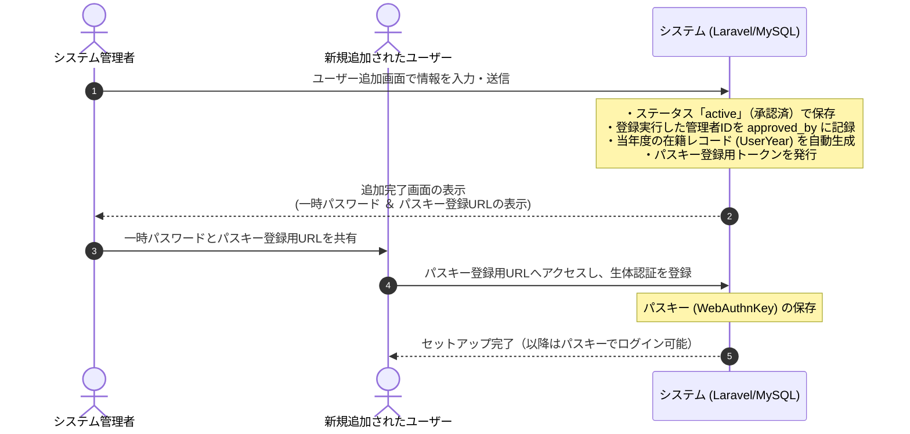

# 保土ケ谷宿場まつり実行委員会 実務管理総合システム 管理者用ユーザー直接追加機能 仕様書

本書は、システム仕様書（[system_specifications.md](../system_common/system_specifications.md)）および機能詳細設計書（[functional_details.md](../system_common/functional_details.md)）に基づき、システム管理グループ（管理者）が直接新規ユーザー（会員）を登録する「管理者用ユーザー直接追加機能」の仕様を定義する。

---

## 1. 機能概要

現在システムには、未ログインのユーザーが自身で登録申請を行う「自主登録申請（仮登録）および承認フロー」が存在するが、これとは別に、システム管理者が権限を用いて**直接正式会員（ステータス：`active`）を登録できる機能**を提供する。

### 1.1 主なユースケース
- 自主的なWeb登録操作が難しい会員の代理登録
- 実行委員会立ち上げ時や年度更新時における、コアメンバーの代理一括登録
- すでに身元が判明している幹事や管理者の迅速なアカウント開設

---

## 2. 業務・認証フロー

本機能は、管理者による入力後、即座に「正式会員」として登録され、同時にパスキー設定用の一時セッション（24時間有効）を発行する。

---

## 3. 画面・機能仕様

### 3.1 会員一覧画面への導線追加
- **対象画面**: `admin.users.index` ([users.blade.php](file:///opt/project/syukuba-executive-committee/resources/views/admin/users.blade.php))
- **変更内容**: 画面上部のヘッダー領域に「➕ 新規会員を直接追加」ボタンを追加する。
- **配置イメージ**:
  「会員名簿 ＆ パスキー（生体認証）管理」タイトルの右側、または「🔄 新年度への移行・引き継ぎ」ボタンの隣。

### 3.2 ユーザー追加画面（管理者専用）
- **ルート**: `admin.users.create` (`GET /admin/users/create`)
- **アクセス制限**: `auth`, `approved`, `admin` (EnsureUserIsSystemAdmin) ミドルウェアによる保護。

#### 3.2.1 入力フォーム項目

| 項目名 | 変数名 / カラム名 | 入力形式 | 必須 / 任意 | 初期値・備考 |
| :--- | :--- | :--- | :--- | :--- |
| **氏名** | `name` | テキスト | 必須 | 最大50文字 |
| **氏名（かな）** | `name_kana` | テキスト | 必須 | 最大100文字、ひらがなのみ |
| **メールアドレス** | `email` | メール | 必須 | 有効なメール形式、`comittee_users` 内で一意（重複不可） |
| **初期パスワード** | `password` | パスワード | 必須 | 半角英数字混在8文字以上。管理者による直接指定、または「自動生成」チェックによる自動生成を選択可能 |
| **本業・職業** | `profession` | テキスト | 必須 | 例：自営業、会社員、電気技師など |
| **所属団体** | `affiliation` | テキスト | 任意 | 例：〇〇町内会、〇〇商店街など |
| **得意分野** | `skills` | チェックボックス | 任意 | 電気、調理、設営、デザイン等のチェック項目（複数選択可） |
| **紹介者** | `referrer_id` / `referrer_text` | セレクトボックス / 自由入力 | 任意 | 既存のアクティブ会員から選択、または自由テキスト（該当なし・自己応募の場合は空欄） |
| **LINEアカウント名** | `line_display_name` | テキスト | 必須 | LINEグループ内の表示名（「この人誰？」防止のため必須） |
| **初期ロール（役割）** | `roles` | チェックボックス | 必須 | 「一般会員 (`general`)」「幹事 (`kanji`)」「システム管理 (`admin`)」から複数選択可（デフォルト：一般会員） |

---

## 4. バックエンド処理・データ保存仕様

管理者がユーザー追加フォームを送信した際、以下のトランザクション処理を実行する。

1. **バリデーションチェック**:
   - 入力値が上記テーブルの型やバリデーションルールに合致していることを検証する。
   - 特にメールアドレスの重複排除を厳格に行う。
2. **会員レコードの作成 (`comittee_users`)**:
   - `status` は `active`（正式会員）として保存する。
   - `approved_by` には、現在ログインしているシステム管理者のユーザーID (`Auth::id()`) を設定する。
   - `approved_at` には現在のタイムスタンプ (`now()`) を設定する。
3. **年度別在籍レコードの作成 (`comittee_user_years`)**:
   - 現在アクティブな年度（セッション `active_fiscal_year` または現在の年 `date('Y')`）の在籍レコードを自動作成する。
   - `roles` はフォームで選択されたロールを設定する。
   - `status` は `active` とする。
4. **パスキー登録セッションの発行 (`comittee_passkey_sessions`)**:
   - 登録されたユーザーに対して、24時間有効なワンタイムURL用トークンを生成し保存する。
5. **完了後のリダイレクトと情報表示**:
   - 会員一覧画面へリダイレクトする。
   - フラッシュメッセージにて「ユーザー登録が完了しました」と表示し、同時に**「一時パスワード」**および**「パスキー登録用ワンタイムURL」**を表示し、管理者が登録対象者に共有できるようにする（承認フローと同様の表示カードを利用）。

---

## 5. セキュリティ・アクセス制御

- **URL直叩き対策**:
  - `GET /admin/users/create` および `POST /admin/users` のルートは、`EnsureUserIsSystemAdmin` ミドルウェアによって保護する。一般会員や幹事が直接アクセスした場合は `403 Forbidden` を返却する。
- **インラインコードの禁止 (CSP準拠)**:
  - 画面作成にあたり、インラインスクリプトおよびインラインCSS（`style="..."` や `<script>` タグ）は一切使用せず、動作制御は外部JSファイルで行う。

---

## 6. 改訂履歴
- 2026-06-22: 新規作成（初版）
