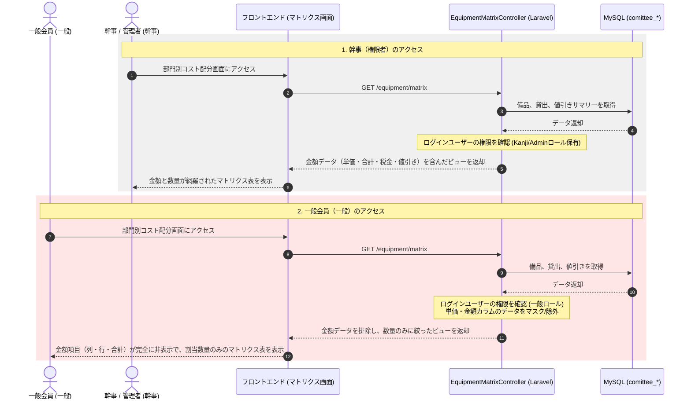

# 備品・外部レンタル管理機能 実装計画書

本計画書は、実行委員会が所有する備品の管理、外部イベント会社（1社）からレンタルする備品およびその諸経費、ならびに部門（グループ）ごとのコスト配分・集計を行う「備品管理モジュール」を実装するための開発ステップを定義する。プログラムの実装自体は行わず、設計・計画のみを提示する。

---

## 1. システム構成・処理フロー

本機能は、Laravel（バックエンド/Bladeテンプレート）、MySQL（データベース）、Bootstrap + Vanilla JS（フロントエンド）の既存スタックに統合する。

### 1.1 部門別コスト集計および金額秘匿フロー
管理者（幹事）には「数量と金額」が表示され、一般会員には「数量のみ」が表示されるまでの処理フローを以下に示す。



---

## 2. データベースマイグレーション設計

既存データベースに、以下の6つのテーブルを追加する。テーブル接頭辞 `comittee_` を使用する。

### 2.1 `comittee_equipments`（備品・諸経費マスタ）
```php
Schema::create('comittee_equipments', function (Blueprint $table) {
    $table->id();
    $table->smallInteger('fiscal_year')->index();
    $table->enum('ownership_type', ['owned', 'rental']); // owned (所有) / rental (レンタル)
    $table->string('name', 100); // 品名
    $table->string('specifications', 100)->nullable(); // 規格・寸法
    $table->integer('quantity')->default(0); // 数量
    $table->string('unit', 20); // 単位 (張, 台, 人, 回, 式等)
    $table->integer('unit_price')->default(0); // 単価 (秘匿対象)
    $table->string('category', 50); // カテゴリ (テント・什器, 諸経費・サービス 等)
    $table->string('image_path', 255)->nullable();
    $table->text('description')->nullable();
    $table->timestamps();
});
```

### 2.2 `comittee_equipment_rental_summaries`（レンタル全体集計）
```php
Schema::create('comittee_equipment_rental_summaries', function (Blueprint $table) {
    $table->id();
    $table->smallInteger('fiscal_year')->unique();
    $table->integer('special_discount')->default(0); // 特別値引き額
    $table->decimal('tax_rate', 4, 2)->default(10.00); // 消費税率 (%)
    $table->text('notes')->nullable();
    $table->timestamps();
});
```

### 2.3 `comittee_storage_locations`（保管場所マスタ）
```php
Schema::create('comittee_storage_locations', function (Blueprint $table) {
    $table->id();
    $table->string('name', 100); // 倉庫名
    $table->string('contact_person', 100)->nullable(); // 鍵管理者等
    $table->text('notes')->nullable();
    $table->timestamps();
});
```

### 2.4 `comittee_equipment_stocks`（場所別実在庫）
```php
Schema::create('comittee_equipment_stocks', function (Blueprint $table) {
    $table->id();
    $table->unsignedBigInteger('equipment_id');
    $table->unsignedBigInteger('storage_location_id');
    $table->integer('quantity')->default(0); // 現在庫数
    $table->timestamps();

    $table->foreign('equipment_id')->references('id')->on('comittee_equipments')->onDelete('cascade');
    $table->foreign('storage_location_id')->references('id')->on('comittee_storage_locations')->onDelete('cascade');
    $table->unique(['equipment_id', 'storage_location_id']);
});
```

### 2.5 `comittee_equipment_loans`（貸出・割当）
```php
Schema::create('comittee_equipment_loans', function (Blueprint $table) {
    $table->id();
    $table->smallInteger('fiscal_year')->index();
    $table->unsignedBigInteger('equipment_id');
    $table->enum('borrower_type', ['gozaichi', 'staff']); // gozaichi (出店者) / staff (実行委部門)
    $table->unsignedBigInteger('borrower_id'); // 出店応募ID または 部門ID
    $table->integer('quantity_requested')->default(0); // 割当（借用希望）数
    $table->integer('quantity_loaned')->default(0); // 実貸出数
    $table->integer('quantity_returned')->default(0); // 返却数
    $table->timestamp('loaned_at')->nullable();
    $table->timestamp('returned_at')->nullable();
    $table->enum('status', ['pending', 'loaned', 'returned', 'partial', 'lost'])->default('pending');
    $table->text('notes')->nullable();
    $table->timestamps();

    $table->foreign('equipment_id')->references('id')->on('comittee_equipments')->onDelete('cascade');
});
```

### 2.6 `comittee_equipment_maintenance_logs`（メンテナンス・状態履歴）
```php
Schema::create('comittee_equipment_maintenance_logs', function (Blueprint $table) {
    $table->id();
    $table->smallInteger('fiscal_year')->index();
    $table->unsignedBigInteger('equipment_id');
    $table->unsignedBigInteger('storage_location_id')->nullable();
    $table->enum('log_type', ['repair', 'discard', 'lost', 'replenish']); // 修理/廃棄/紛失/補充
    $table->integer('quantity')->default(0);
    $table->text('description')->nullable();
    $table->timestamp('recorded_at');
    $table->timestamps();

    $table->foreign('equipment_id')->references('id')->on('comittee_equipments')->onDelete('cascade');
});
```

---

## 3. 影響コンポーネントと実装ステップ

### ステップ 1: ルーティングとミドルウェア定義
* **[routes/web.php](file:///opt/project/syukuba-executive-committee/routes/web.php) の更新**:
  - 一般会員の閲覧ルートと、幹事・管理者用ルート（ミドルウェア `kanji` または 新規ポリシー制限）に分けて定義。

```php
Route::middleware(['auth', 'approved'])->prefix('equipment')->name('equipment.')->group(function () {
    // 共通閲覧（一般・幹事共通、ただし金額はBladeで出し分け）
    Route::get('/dashboard', [EquipmentDashboardController::class, 'index'])->name('dashboard');
    Route::get('/list', [EquipmentController::class, 'index'])->name('list');
    Route::get('/matrix', [EquipmentMatrixController::class, 'index'])->name('matrix'); // 部門別コスト配分マトリクス
    Route::get('/loans', [EquipmentLoanController::class, 'index'])->name('loans.index');

    // 幹事・管理者・備品管理ロール専用（CUDおよび金額設定・レンタル詳細）
    Route::middleware(['kanji'])->group(function () {
        Route::resource('items', EquipmentManageController::class)->except(['show', 'index']);
        Route::resource('locations', StorageLocationController::class)->except(['show']);
        Route::post('/loans/{id}/status', [EquipmentLoanController::class, 'updateStatus'])->name('loans.status');
        Route::put('/rental-summary', [EquipmentRentalController::class, 'updateSummary'])->name('rental.summary');
    });
});
```

### ステップ 2: モデルと金額計算ロジックの実装

* **`Equipment` モデル (`app/Models/Equipment.php`)**:
  - レンタル品金額の自動算出アクセサ（`total_amount` の取得）を定義する。
  - **スコープ機能の定義**: 物理的な在庫が必要な機材のみを抽出するスコープ（`scopePhysicalItems($query)`）を追加し、`category != '諸経費・サービス'` の機材だけを在庫管理テーブルに登録できるようにする。

* **`EquipmentRentalSummary` モデル (`app/Models/EquipmentRentalSummary.php`)**:
  - レンタル総額（すべての機材・諸経費の合算 ➡️ 特別値引きのマイナス ➡️ 消費税10%適用）の算出ロジックを実装。
  - **金額秘匿ポリシーの連携**: ログイン中のユーザーが金額秘匿対象（一般会員など）か判断するヘルパーメソッドを配置。

---

### ステップ 3: コントローラの実装とセキュリティ制御

* **`EquipmentMatrixController.php` (部門別コスト集計)**:
  - ござ市出店者（`borrower_type = 'gozaichi'`）および実行委員会内部門（`borrower_type = 'staff'`）ごとに、備品割当数量を集計し、二次元の連想配列（マトリクスデータ）を生成する。
  - ログインユーザーが `kanji` / `admin` / `equipment_manager` ロールを持っていない場合、コントローラ内またはBlade内で金額関連データ（`unit_price`, `total_amount`, 各部門の合計金額など）を強制的にビュー変数から削除またはマスクする。

---

### ステップ 4: フロントエンド Blade / JS の実装（金額秘匿の出し分け）

#### 1. 部門別コスト配分マトリクス画面 (`resources/views/equipment/matrix.blade.php`)
- **管理者・幹事用の表示**:
  - 横軸に部門（ステージ、食品衛生など）、縦軸にレンタル機材・諸経費を一覧表示し、各交差セルに「数量（単価×数量＝金額）」を表示。
  - 表の最下部および右端に、部門別合計金額および見積・税込請求額（消費税、値引き）を表示。
- **一般会員用の表示（情報秘匿）**:
  - 以下のBladeディレクティブを用いて、金額情報を含む列や行を完全に非表示化（HTMLソースレベルでも出力しない）し、交差セルには**「割当数量」のみ**を表示する。

```html
@can('view-financials')
    <!-- 幹事・管理者向け：単価および金額合計列の表示 -->
    <th>単価</th>
    <th>合計金額</th>
@endcan

<!-- 各セルの出力例 -->
<td>
    {{ $loan->quantity_requested }}
    @can('view-financials')
        <small class="text-muted">({{ number_format($loan->quantity_requested * $item->unit_price) }}円)</small>
    @endcan
</td>
```

- **ポリシー定義 (`app/Policies/EquipmentPolicy.php` または `AuthServiceProvider`)**:
  - `'view-financials'` ゲートを定義し、ユーザーが `admin`, `kanji`, `equipment_manager` のいずれかの属性を持っている場合のみ `true` を返すように実装する。

---

## 4. テスト・検証計画

### 4.1 ユニットテスト
- **金額計算・税金適用ロジックのテスト**:
  - 登録された機材レンタル費・運搬人件費の合計 ➡️ 値引き ➡️ 消費税10%適用が、PDF資料（税込合計 1,688,995円等）と同じ数式で正しく算出されるかをPHPUnitでテストする。
- **物理在庫抽出テスト**:
  - 在庫管理対象外である「諸経費・サービス」カテゴリの項目が、在庫登録処理（`EquipmentStock` への追加）時に正しくスキップされるか検証する。

### 4.2 統合テスト (金額秘匿ポリシーの検証)
- **一般会員権限でのAPI・画面表示テスト**:
  - 一般ユーザーとしてログインしたセッションにおいて、マトリクス画面 (`/equipment/matrix`) やマスタ API にアクセスした際、レスポンスのHTMLまたはJSONデータ内に「単価 (unit_price)」「金額 (total_amount)」などの文言や数値が一切含まれていないことをアサーション（`$response->assertDontSee()`）で厳格に検証する。
