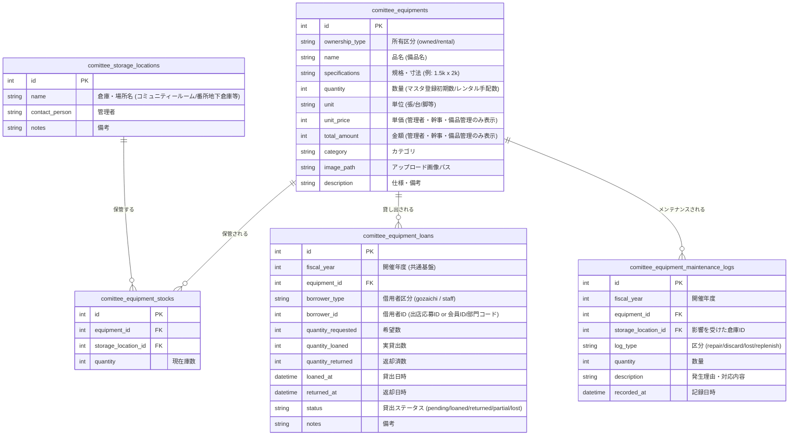

# 保土ケ谷宿場まつり 備品管理機能 仕様書（案）

本機能は、保土ケ谷宿場まつり実行委員会（以下、実行委員会）が所有する備品、および外部イベント会社からレンタルする備品の在庫、保管場所、まつり期間中の貸出・割当状況を一元的に管理し、備品の紛失・破損リスクの低減と配布・手配実務の効率化を図るためのモジュールである。

---

## 1. 機能概要

まつりに関わるすべての備品（テント、机、椅子、音響スピーカー、消火器、カラーコーンなど）を対象とし、以下の業務プロセスをシステム化する。
1. **備品台帳のデジタル化（画像対応）**: 実行委員会所有またはレンタルする備品の総数、規格・寸法、単価、状態を画像とともに登録。
2. **所有区分の管理**: 「実行委員会所有」と「外部イベント会社からのレンタル」を区別し、手配・費用の管理に対応。
3. **保管場所の可視化**: コミュニティールームや番所地下倉庫など、どの場所にどの備品が保管されているかを管理。
4. **貸出・割当管理**: ござ市の出店者や、実行委員会内の各班（本陣、救護所、ゲート等）への貸出・回収状況の記録。
5. **メンテナンス・状態管理**: 破損、修理、紛失、新規購入に伴う在庫数の増減履歴の記録。

### 1.2 作成機能一覧
本モジュールで実装する具体的な機能は以下の通りである。

| 機能グループ | 作成機能名 | 主な処理内容 |
| :--- | :--- | :--- |
| **備品マスタ（台帳）管理** | 備品情報の新規追加・編集・削除 | 品名、所有区分、規格・寸法、単位、単価、カテゴリ等の登録。画像のアップロード・紐付け機能。 |
| **保管場所（倉庫）管理** | 保管場所の新規追加・編集・削除 | コミュニティールーム、番所地下倉庫などの保管場所の登録。担当者や備考（鍵の場所等）の記録。 |
| **在庫管理** | 拠点別在庫登録・手動調整 | 備品別×保管場所別の在庫数の登録、棚卸等に伴う現在庫数の手動調整（調整ログの記録）。 |
| **外部レンタル管理** | レンタル品手配・費用自動集計 | 外部イベント会社からレンタルする備品の手配数量・単価から、合計金額（数量×単価）および発注費用の総額を自動算出。 |
| **貸出・割当管理** | ござ市出店者への貸出登録・連動 | ござ市出店応募時に申請された希望備品数（テント・机・椅子等）とのデータ連動、および当日貸出情報の登録。 |
| | 実行委内部への備品割当登録 | 本陣、救護班、ステージ、各ゲートなどの各班への備品割当数の登録。 |
| | 現場引渡・返却ステータス更新 | まつり当日、備品の引渡時（「貸出中」）および返却時（「返却済」）のステータス変更処理（一部返却や紛失などのステータス管理含む）。 |
| **破損・状態管理** | 破損・メンテナンス履歴登録 | 破損、要修理、紛失、廃棄、新規購入補充の記録。紛失や廃棄確定時の実在庫テーブルからの自動減算連動。 |
| **年度データ移行** | 前年度データ引き継ぎ | システム共通基盤と連動し、前年度の備品マスタおよび保管場所情報を新年度のデータベースへコピー移行する処理。 |

---

## 2. 業務・機能要件

### 2.1 共通基盤との連動（開催年・年度管理）
- すべての備品貸出・割当履歴、および破損・補充ログは、グローバルコンテキストの「開催年（年度）」に紐づいて管理される。
- 新年度立ち上げ時、前年度の備品マスタおよび保管場所マスタの情報を一括移行（コピー）し、毎年の入力作業を省略できる仕組みを設ける。

### 2.2 備品マスタ（台帳）管理
実行委員会が管理するすべての備品定義を登録・編集する。
- **所有区分**: 「実行委員会所有（owned）」または「外部イベント会社レンタル（rental）」を選択。
- **画像アップロード機能**: 
  - 現場のスタッフや出店者が一目で備品を識別できるよう、jpeg/pngなどの備品画像をアップロードして台帳に紐づける。
- **管理基本項目**:
  - **備品ID/コード**: システム内部IDおよび実物に貼る管理用識別コード。
  - **所有区分**: 実行委所有 / 外部レンタル。
  - **備品名 / 品名**: （例: ワンタッチテント、会議用長机、プラスチック丸椅子、発電機など）
  - **規格・寸法**: （例: 「3m×3m」「180cm×45cm」「1.5k × 2k」など）※レンタル備品では必須。
  - **カテゴリ**: 分類（例: 什器・テント、音響・電気、保安・防災、看板・装飾など）
  - **単位**: 表示単位（張、台、脚、個など）※レンタル備品では必須。
  - **画像パス**: アップロードされた画像のファイルパス。

### 2.3 保管場所（倉庫）管理
備品が格納されている物理的な拠点・倉庫を登録する。
- **保管場所ID/コード**
- **場所名**: コミュニティールーム、番所地下倉庫など、具体的な保管場所を登録・管理する。
- **アクセス情報・管理者**: 担当者名や鍵の所在などのテキスト情報。

### 2.4 在庫管理（拠点別在庫数）
同一の備品が複数の場所に分散して保管されているケースに対応するため、**「備品ID × 保管場所ID」**をキーとして在庫数を管理する。
- **総在庫数**: 各保管場所の在庫数の合算。
- **保管場所別在庫**: 保管場所ごとの現在庫数。
- **在庫調整**: 数量の手動調整（棚卸時のズレ修正など）をログ付きで行えるようにする。
- ※外部イベント会社からのレンタル備品の場合、通常はまつり直前に搬入され直後に搬出されるため、デフォルト保管場所を「イベント会社」または「各配備エリア」とし、期間中の在庫として扱う。

### 2.5 外部レンタル備品の管理要件
イベント会社から有料でレンタルする備品については、手配数量と発生費用の正確な集計を行うため、以下の必須管理項目を設ける。
- **レンタル管理項目**:
  - **品名** (例: パイプテント)
  - **規格・寸法** (例: 1.5k x 2k)
  - **数量** (例: 15)
  - **単位** (例: 張)
  - **単価** (例: 8,000)
  - **金額** (自動計算: 数量 × 単価 = 120,000)
- **費用集計**:
  - レンタル備品マスタに登録された数量と単価を基に、イベント会社ごとの「見積・請求総額」をシステム上で自動計算し、会計管理やござ市出店者からの回収費用の対比に活用する。

### 2.6 貸出・割当管理
まつり当日の備品貸出・割当プロセスを記録・追跡する。
- **借用者区分**:
  - **出店者**: 「ござ市出店応募者」と連携（希望された備品貸出数の集計と同期）。
  - **実行委員（班別）**: （例: 「本部・本陣」「救護班」「イベントステージ担当」「北側ゲート担当」など）
- **貸出計画と実務フロー**:
  1. **割当登録**: 誰が, どの備品を、何個必要としているかを登録（ござ市応募時は自動的に仮登録）。
  2. **引渡処理**: 貸出日時に備品を引き渡した際、「貸出中」にステータスを変更。
  3. **返却処理**: まつり終了後、返却された備品数を確認し「返却済」にする。一部破損や紛失があった場合は、数量を部分返却とし、メンテナンス履歴へエスカレーションする。

### 2.7 破損・メンテナンス管理
当日発生した破損や紛失、および新規購入による補充などを履歴として記録する。
- **区分**: 破損（要修理）、破損（廃棄）、経年劣化、紛失、新規購入補充。
- **数量・内容**: 発生数と、原因や対応内容のテキスト。
- 在庫管理（実在庫テーブル）と連動し、廃棄や紛失が確定した時点で該当場所の在庫数が自動でマイナスされる。

### 2.8 アクセス権限および金額秘匿要件
本モジュールのセキュリティ要件および閲覧制限は以下の通りとする。

#### 2.8.1 操作権限（登録・編集・削除など）
備品の追加、編集、削除（CUD処理）および在庫の調整、貸出処理などの変更操作は、以下のグループに所属するユーザーのみに制限する。
- **システム管理** グループのメンバー
- **幹事** グループのメンバー
- **備品管理** グループ（新規ロール: `equipment_manager`）のメンバー
- ※一般ユーザー（一般会員）はこれらの変更・登録操作を行うことができず、閲覧のみが可能となる。

#### 2.8.2 情報秘匿（一般ユーザー向けの金額非表示）
一般ユーザーが本モジュールを閲覧する際、会計情報や外部との金銭的な契約情報を保護するため、金額に関わる以下の情報を秘匿（非表示）とする。
- **秘匿対象項目**:
  - レンタル備品または所有備品の**「単価（unit_price）」**
  - 単価と数量から計算される**「金額（total_amount）」**
  - ダッシュボードに表示される外部レンタル備品の**「手配総額（発注総額）」**などの集計情報
- ※「システム管理」「幹事」および「備品管理」グループのユーザーは、すべての金額情報を閲覧することができる。

---

## 3. データベース設計（テーブル定義案）

テーブルの接頭辞はシステム共通仕様に従い `comittee_` とする。

---

## 4. UI/UX デザイン（画面構成案）

Bootstrapおよび和モダン調のプレミアムデザインをベースとした以下の画面で構成する。
1. **備品ダッシュボード**: 
   - 備品全体の在庫概況、現在貸出中の数、紛失・破損アラート。
   - **管理者・幹事・備品管理のみ**: 外部レンタル品手配状況および費用合計（発注総額）の集計パネルを表示。
2. **備品・倉庫一覧（台帳画面）**:
   - 備品マスタの追加・編集（画像アップロードフォーム含む。権限者のみ表示）。
   - 倉庫（コミュニティールーム/番所地下倉庫等）の在庫ヒートマップやビジュアルカード表示。
   - **一般ユーザー**: 規格や在庫数は表示するが、単価・金額の項目自体を表示しない。
3. **貸出・割当管理画面**:
   - 貸出先ごとのステータス一覧。ござ市モジュールと連携し、「引渡」「返却」のワンクリックチェックボタン（変更は権限者のみ）。
4. **メンテナンスログ画面**:
   - 破損・補充の履歴一覧および新規登録フォーム（追加は権限者のみ）。
