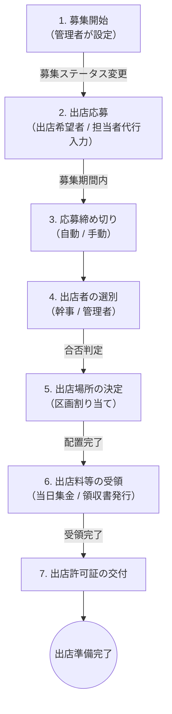
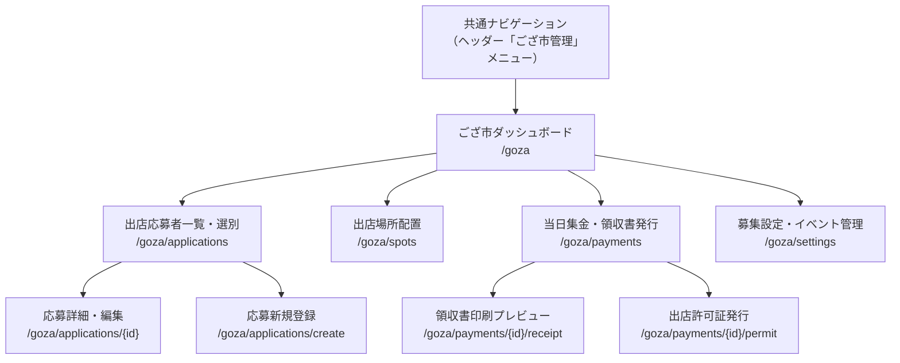

# 保土ケ谷宿場まつり実行委員会 実務管理総合システム ござ市管理機能 仕様書

本書は、システム仕様書（[system_specifications.md](../system_common/system_specifications.md)）および機能詳細設計書（[functional_details.md](../system_common/functional_details.md)）に基づき、「ござ市」の出店者管理機能の要件・業務フロー・データモデル・画面設計の詳細を定義する。

本機能は、既存の独立システム（[syukuba-gozaichi specification.md](file:///opt/project/syukuba-gozaichi/specification.md)）の仕様を本実務管理総合システムに統合し、共通基盤（認証・年度管理・会員管理）と連携する形で再設計したものである。

---

## 1. 機能概要

「ござ市」は保土ケ谷宿場まつりの中核イベントであり、地域の商店や個人が路上にゴザを敷いて出店する物販・飲食のフリーマーケットである。
本機能は、ござ市の出店者情報の収集、選別、区画配置、出店料・備品貸出料・ゴミ袋料の受領管理、および出店許可証の交付までの一連の実務プロセスをデジタル化する。

### 1.1 統合方針

旧ござ市管理システム（`syukuba-gozaichi`）は独自の認証基盤・ユーザー管理を持つ独立アプリケーションであったが、本統合により以下の共通基盤を活用する設計へ移行する。

| 項目 | 旧システム（syukuba-gozaichi） | 統合後（本システム） |
| :--- | :--- | :--- |
| **認証** | 独自の `users` テーブル / WebAuthn | 本システムの `comittee_users` / 共通WebAuthn認証基盤 |
| **権限管理** | `groups` + `group_user` 中間テーブル | `comittee_users.roles` JSON カラム（既存の `kanji` / `admin` ロールを利用） |
| **年度管理** | 独自の `gozaichi_events` テーブル | 本システムの共通年度管理（`comittee_user_years.fiscal_year`）と連携 |
| **テーブル命名** | Laravel標準（接頭辞なし） | `comittee_` 接頭辞を付与 |
| **CSP** | 独立したCSPポリシー | 本システム共通のCSP（インラインCSS/JS禁止）を適用 |
| **URL** | `https://gozaichi.syukuba.home` | `https://www.syukuba.home/goza/*` として統合 |

---

## 2. 権限・アクセス制御

### 2.1 ござ市関連ロール
ござ市管理機能においては、新たなロールの追加は行わず、既存の `kanji`（幹事）および `admin`（システム管理）ロールにすべての実務権限を集約する。

| ロール名 | 値 | ござ市機能における権限 |
| :--- | :--- | :--- |
| **幹事** | `kanji` | 出店応募の閲覧・選別、区画配置、集金処理、領収書・許可証発行等のござ市実務全般 |
| **システム管理** | `admin` | 幹事のすべての権限に加え、募集設定の変更、イベント管理等の管理者限定操作 |
| **一般会員** | `general` | ござ市管理画面へのアクセス不可 |

### 2.2 アクセス制御方針
- ござ市管理機能（`/goza/*`）は、`roles` に `kanji` または `admin` を含むユーザーのみがアクセス可能とする。
- 既存の `auth` + `approved` ミドルウェアに加え、ござ市専用のミドルウェア（`gozaichi` もしくは `EnsureUserIsKanjiOrAdmin`）を新規作成し、ロールチェックを行う。
- 一般会員がURLを直接入力してアクセスした場合は `403 Forbidden` を返却する。

---

## 3. 業務フロー

ござ市の出店に関わる実務は、以下の7段階のプロセスで構成される。



### 各プロセスの詳細

| No | プロセス | 主な実務内容 | システム上の操作 |
| :--- | :--- | :--- | :--- |
| **1** | **募集開始** | 実行委員会がござ市の出店募集を開始する。 | 管理者がイベント設定画面で募集期間（開始・終了日時）を設定し、ステータスを「募集中」に変更する。 |
| **2** | **出店応募** | 出店希望者が応募情報を登録する。 | 応募フォームに屋号、加盟状況、火気使用、食品取扱、備品希望数等を入力して送信する。 |
| **3** | **応募締め切り** | 募集期間終了後、応募受付を停止する。 | 募集終了日時に自動締切、または管理者が手動で締め切る。 |
| **4** | **出店者の選別** | 応募者一覧を確認し、出店の可否を決定する。 | 幹事（または管理者）が各応募者のステータスを「当選（出店許可）」または「落選」に変更する。 |
| **5** | **出店場所の決定** | 当選者に会場内の出店区画を割り当てる。 | 幹事（または管理者）が区画コード（例: `A15`, `B20-21`）を入力し、重複チェック後に確定する。 |
| **6** | **出店料等の受領** | まつり当日に出店料・備品料・ゴミ袋料を集金する。 | 集金画面で料金を自動計算し、「受領」操作と同時に領収書を印刷・発行する。 |
| **7** | **出店許可証の交付** | 料金受領と並行して出店許可証を交付する。 | 受領完了画面で「出店許可証交付済み」チェックを記録する。 |

---

## 4. 料金体系・集金計算規則

出店当日に回収する料金は以下の3区分から構成される。

```
【料金計算式】
総合計 ＝ ①出店料 ＋ ②備品貸出料 ＋ ③ゴミ袋料
```

### 4.1 出店料（Exhibition Fee）

出店料は、出店者の「加盟状況」と「区画種類」および「区画数」に基づき算出する。

#### 区画種類の定義

| 区画種類コード | 名称 | 説明 |
| :--- | :--- | :--- |
| `general` | 一般（物販） | 飲食物以外の物品販売ブース（手芸品・余品など） |
| `A` | 火器なし食品 | 火器を使用しないが飲食物を販売するブース（野菜等の生もの・加工食品含む） |
| `B` | 火器使用飲食 | その場で火器を使用して飲食物を製造・販売するブース |

#### 1区画目の料金

| 加盟状況 | 一般（物販） | A（火器なし食品） | B（火器使用飲食） |
| :--- | :--- | :--- | :--- |
| **加盟** | 2,000円 | 2,000円 | 2,000円 |
| **なし（一般）** | 6,000円 | 8,000円 | 10,000円 |

> [!NOTE]
> 加盟出店者の1区画目は、区画種類に関わらず一律 **2,000円** である。

#### 2区画目以降の料金（1区画あたり）

| 加盟状況 | 一般（物販） | A（火器なし食品） | B（火器使用飲食） |
| :--- | :--- | :--- | :--- |
| **加盟** | 3,000円 | 4,000円 | 5,000円 |
| **なし（一般）** | 6,000円 | 8,000円 | 10,000円 |

> [!NOTE]
> 加盟出店者の2区画目以降は、一般料金の半額が適用される。

### 4.2 備品貸出料（Equipment Rental Fee）

| 貸出品目 | 単価（1個/1張/1台/1脚あたり） |
| :--- | :--- |
| テント（1張） | 4,500円 |
| ウエイト（1個） | 500円 |
| 机（1台） | 2,500円 |
| 椅子（1脚） | 500円 |

> [!IMPORTANT]
> 備品貸出料については、実務上の特別な事情（破損品の値引き等）に対応するため、**手動金額上書き（調整）フィールド**を設ける。

### 4.3 ゴミ袋料（Garbage Bag Fee）

| ゴミ袋種別 | 単価（1枚あたり） |
| :--- | :--- |
| ゴミ袋 45L | 500円 |
| ゴミ袋 70L | 700円 |

> [!NOTE]
> **一般出店者（加盟なし）**には、1ブースあたり **ゴミ袋45L × 2枚**（ビン・カン用1枚、一般ごみ用1枚）が無料枠として初期付与される。追加購入分のみ課金する。

---

## 5. 画面設計・機能詳細

### 5.1 画面遷移図



### 5.2 ござ市ダッシュボード（`/goza`）

- **対象**: `kanji` または `admin` ロールを持つユーザー
- **表示内容**:
  - 現在の募集ステータス（募集前 / 募集中 / 締切済）
  - 応募数 / 当選数 / 集金済み数のサマリーカード
  - 直近の更新履歴

### 5.3 出店応募管理機能

#### F5.3.1 出店応募フォーム（`/goza/applications/create`）
- **対象**: `kanji` または `admin` ロールを持つユーザー（担当者代行入力）
- **入力項目**:

| 項目名 | 入力タイプ | 必須 | バリデーション・備考 |
| :--- | :--- | :--- | :--- |
| 屋号・団体名 | テキスト | 必須 | 最大100文字 |
| 出店者氏名 | テキスト | 必須 | 最大50文字 |
| 加盟状況 | ラジオボタン | 必須 | `加盟` / `なし（一般）` |
| 紹介者名 | テキスト | 任意 | 商店街加盟店または実行委員の推薦者名 |
| 紹介者連絡先 | テキスト | 任意 | 紹介者の連絡先情報 |
| 希望区画数 | 数値 | 必須 | 1〜3区画（`min:1`, `max:3`） |
| 1区画目の種類 | セレクト | 必須 | `general` / `A` / `B` |
| 2区画目以降の種類 | セレクト | 条件付き | 希望区画数が2以上の場合に必須。`general` / `A` / `B` |
| 火気使用 | ラジオボタン | 必須 | `有` / `無` |
| 使用器具 | テキスト | 条件付き | 火気使用「有」の場合に必須 |
| 使用器具台数 | 数値 | 条件付き | 火気使用「有」の場合。`min:1` |
| 使用燃料 | テキスト | 条件付き | 火気使用「有」の場合に必須（例: プロパンガス、カセットガス、電気等） |
| 食品取扱 | ラジオボタン | 必須 | `有` / `無` |
| 食品衛生等の誓約 | チェックボックス | 条件付き | 食品取扱「有」の場合に必須。保健所指導および食品表示法遵守への同意 |
| テント希望数 | 数値 | 任意 | `min:0` |
| ウエイト希望数 | 数値 | 任意 | `min:0` |
| 机希望数 | 数値 | 任意 | `min:0` |
| 椅子希望数 | 数値 | 任意 | `min:0` |
| ゴミ袋 45L 希望数 | 数値 | 任意 | `min:0` |
| ゴミ袋 70L 希望数 | 数値 | 任意 | `min:0` |

> [!WARNING]
> **発電機は使用不可**。火気使用の「使用器具」入力時に発電機が記入された場合、バリデーションまたはUIでの注意喚起を行う。

#### F5.3.2 出店応募一覧・選別（`/goza/applications`）
- **対象**: `kanji` または `admin` ロールを持つユーザー
- **表示項目**: 屋号、出店者名、加盟状況、区画種類、希望区画数、紹介者、応募ステータス
- **応募ステータスの状態遷移**:

| ステータス値 | 表示名 | 説明 |
| :--- | :--- | :--- |
| `draft` | 一時保存 | 応募情報入力中（未送信） |
| `submitted` | 応募済 | 正式に応募が完了した状態 |
| `accepted` | 当選（出店許可） | 選別の結果、出店が許可された状態 |
| `rejected` | 落選 | 選別の結果、出店が不許可となった状態 |

- **操作**: ステータス変更のドロップダウン、応募詳細への遷移リンク

### 5.4 出店場所配置機能（`/goza/spots`）

- **対象**: `kanji` または `admin` ロールを持つユーザー
- **機能概要**: 当選（`accepted`）した出店者に対し、会場の区画コード（例: `A15`, `B20-21`）を割り当てる。
- **重複防止チェック**: 同一区画番号が別の出店者に既に割り当てられている場合は、リアルタイムでエラーを表示し登録を拒否する。

> [!IMPORTANT]
> **保健所指導に基づくアラート**: 区画種類が `B`（火器使用飲食）の出店者を配置する際、「調理を伴うため3方幕テントが必要です」と警告を自動表示し、準備漏れを防止する。

### 5.5 当日集金・料金計算機能（`/goza/payments`）

- **対象**: `kanji` または `admin` ロールを持つユーザー
- **機能概要**: 出店当日に各ブースから出店料・備品料・ゴミ袋料を集金するための専用画面。

#### 料金自動計算ロジック

```
①出店料 = 1区画目料金（加盟状況 × 1区画目種類） 
         + 2区画目以降料金（加盟状況 × 2区画目種類 × (区画数 - 1)）

②備品貸出料 = (テント数 × 4,500) + (ウエイト数 × 500) + (机数 × 2,500) + (椅子数 × 500)
             ※ 手動金額上書きが設定されている場合はその値を優先

③ゴミ袋料 = (ゴミ袋45L追加数 × 500) + (ゴミ袋70L追加数 × 700)
           ※ 一般出店者（加盟なし）は45L×2枚分を初期付与として差し引き

総合計 = ①出店料 + ②備品貸出料 + ③ゴミ袋料
```

- **画面要素**:
  - 出店者選択ドロップダウン（当選済み出店者のみ表示）
  - 料金内訳のリアルタイムプレビュー表示
  - 「受領」ボタン → `is_paid = true` + `payment_received_at` を記録

### 5.6 領収書・出店許可証の発行

#### F5.6.1 領収書（`/goza/payments/{id}/receipt`）
- 「受領」操作と同時に領収書の印刷用プレビューを表示する。
- ブラウザ of 印刷機能（`window.print()`）に適したプレーンなCSSレイアウトとする。
- 印刷内容: 屋号名、出店料内訳、備品料内訳、ゴミ袋料内訳、総合計、受領日時、実行委員会名

#### F5.6.2 出店許可証（`/goza/payments/{id}/permit`）
- 受領完了画面に「出店許可証を交付しました」チェック項目を設け、実務フローの漏れを防止する。
- 出店許可証の印刷プレビューも合わせて提供する。

### 5.7 募集設定・イベント管理（`/goza/settings`）

- **対象**: `admin` ロールを持つユーザーのみ
- **設定項目**:
  - 募集開始日時 / 募集終了日時
  - 募集ステータスの手動切り替え（募集前 / 募集中 / 締切済）
  - 料金マスタ（各区画種類・備品・ゴミ袋の単価設定 ← 将来の値上げ対応）

---

## 6. データベース設計

本システム共通のテーブル命名規則（`comittee_` 接頭辞）に準拠する。
年度管理は既存の `fiscal_year` メカニズムと連携する。

### 6.1 `comittee_gozaichi_events` テーブル（ござ市イベント年度管理）

| カラム名 | データ型 | 制約 | 説明 |
| :--- | :--- | :--- | :--- |
| `id` | BigInt | PK, Auto Increment | イベントID |
| `fiscal_year` | SmallInt | Not Null, Unique | 開催年（例: `2026`）。既存の年度管理と連携 |
| `recruitment_start_at` | Timestamp | Nullable | 募集開始日時 |
| `recruitment_end_at` | Timestamp | Nullable | 募集締め切り日時 |
| `recruitment_status` | Enum | Not Null, Default `'closed'` | `'closed'`（募集前/締切済）, `'open'`（募集中） |
| `is_active` | Boolean | Not Null, Default `false` | 現在のアクティブイベントフラグ |
| `created_at` | Timestamp | Nullable | レコード作成日時 |
| `updated_at` | Timestamp | Nullable | レコード更新日時 |

### 6.2 `comittee_gozaichi_applications` テーブル（出店応募・集金管理）

| カラム名 | データ型 | 制約 | 説明 |
| :--- | :--- | :--- | :--- |
| `id` | BigInt | PK, Auto Increment | 応募ID |
| `event_id` | BigInt | FK → `comittee_gozaichi_events.id` | 所属するイベント年度 |
| `shop_name` | Varchar(100) | Not Null | 屋号・団体名 |
| `exhibitor_name` | Varchar(50) | Not Null | 出店者氏名 |
| `is_member` | Boolean | Not Null, Default `false` | 加盟状況（`true` = 加盟, `false` = なし） |
| `introducer_name` | Varchar(100) | Nullable | 紹介者名 |
| `introducer_contact` | Varchar(100) | Nullable | 紹介者連絡先 |
| `status` | Enum | Not Null, Default `'draft'` | `'draft'`, `'submitted'`, `'accepted'`, `'rejected'` |
| `spot_code` | Varchar(20) | Nullable | 区画コード（例: `A15`, `B20-21`） |
| `section_count` | TinyInt | Not Null, Default `1` | 出店区画数（1〜3） |
| `first_section_type` | Enum | Not Null | `'general'`, `'A'`, `'B'` |
| `subsequent_section_type` | Enum | Nullable | `'general'`, `'A'`, `'B'`（2区画目以降） |
| `has_fire` | Boolean | Not Null, Default `false` | 火気・燃焼器具使用有無 |
| `fire_equipment` | Varchar(100) | Nullable | 具体的な使用器具種別 |
| `fire_equipment_count` | TinyInt | Not Null, Default `0` | 使用器具台数 |
| `fire_fuel` | Varchar(100) | Nullable | 使用燃料 |
| `has_food` | Boolean | Not Null, Default `false` | 食品取扱有無 |
| `has_food_pledge` | Boolean | Not Null, Default `false` | 食品衛生規則・表示義務への誓約 |
| `rentals` | JSON | Nullable | 貸出備品・ゴミ袋の希望数 |
| `exhibition_fee` | Int | Nullable | 計算後の出店料小計（円） |
| `equipment_fee` | Int | Nullable | 計算後の備品貸出料小計（円）。手動調整を許容 |
| `equipment_fee_override` | Int | Nullable | 備品料の手動上書き金額（`NULL` の場合は自動計算値を使用） |
| `trash_bag_fee` | Int | Nullable | 計算後のゴミ袋料小計（円） |
| `total_fee` | Int | Nullable | 総合計金額（円） |
| `is_paid` | Boolean | Not Null, Default `false` | 支払いステータス |
| `payment_received_at` | Timestamp | Nullable | 領収日時 |
| `permit_issued` | Boolean | Not Null, Default `false` | 出店許可証交付済みフラグ |
| `created_at` | Timestamp | Nullable | 応募日時 |
| `updated_at` | Timestamp | Nullable | 更新日時 |

#### `rentals` JSON カラムの構造

```json
{
  "tent": 1,
  "weight": 4,
  "desk": 1,
  "chair": 2,
  "trash_bag_45": 0,
  "trash_bag_70": 0
}
```

### 6.3 `comittee_gozaichi_fee_settings` テーブル（料金マスタ）

年度ごとの料金単価をマスタデータとして保持し、将来の値上げ等に柔軟に対応する。

| カラム名 | データ型 | 制約 | 説明 |
| :--- | :--- | :--- | :--- |
| `id` | BigInt | PK, Auto Increment | 設定ID |
| `event_id` | BigInt | FK → `comittee_gozaichi_events.id` | 所属イベント年度 |
| `fee_key` | Varchar(50) | Not Null | 料金キー（例: `member_1st`, `general_A_2nd`, `tent`, `trash_45` 等） |
| `fee_value` | Int | Not Null | 単価（円） |
| `created_at` | Timestamp | Nullable | レコード作成日時 |
| `updated_at` | Timestamp | Nullable | レコード更新日時 |

> [!TIP]
> 新年度のイベント作成時に、前年度の料金マスタを一括コピーすることで、基本設定の引き継ぎを容易にする設計とする。これは既存の年度引き継ぎ機能（[functional_details.md F3.2](../system_common/functional_details.md)）の「その他データのコピー」に該当する。

---

## 7. ルーティング設計

既存のルート定義（[web.php](file:///opt/project/syukuba-executive-committee/routes/web.php)）に、以下のルートグループを追加する。

```
Route::middleware(['auth', 'approved', 'gozaichi'])->prefix('goza')->name('goza.')->group(function () {
    // ダッシュボード
    GET  /goza                          → GozaichiController@index

    // 出店応募管理
    GET  /goza/applications             → GozaichiApplicationController@index
    GET  /goza/applications/create      → GozaichiApplicationController@create
    POST /goza/applications             → GozaichiApplicationController@store
    GET  /goza/applications/{id}        → GozaichiApplicationController@show
    GET  /goza/applications/{id}/edit   → GozaichiApplicationController@edit
    PUT  /goza/applications/{id}        → GozaichiApplicationController@update
    PUT  /goza/applications/{id}/status → GozaichiApplicationController@updateStatus

    // 出店場所配置
    GET  /goza/spots                    → GozaichiSpotController@index
    PUT  /goza/spots/{id}               → GozaichiSpotController@update

    // 当日集金・領収書・許可証
    GET  /goza/payments                 → GozaichiPaymentController@index
    PUT  /goza/payments/{id}/receive     → GozaichiPaymentController@receive
    GET  /goza/payments/{id}/receipt    → GozaichiPaymentController@receipt
    GET  /goza/payments/{id}/permit     → GozaichiPaymentController@permit

    // 募集設定・イベント管理（admin限定）
    GET  /goza/settings                 → GozaichiSettingController@index
    PUT  /goza/settings                 → GozaichiSettingController@update
});
```

> [!NOTE]
> `gozaichi` ミドルウェアは、ログイン中のユーザーが `kanji` または `admin` ロールを所持しているか検証するように動作させる。

---

## 8. 既存機能との連携ポイント

### 8.1 共通年度管理との連携
- `comittee_gozaichi_events.fiscal_year` は、既存の `comittee_user_years.fiscal_year` と同じ値体系を共有する。
- 共通ヘッダーの年度切り替えドロップダウンと連動し、選択された年度のござ市データに自動フィルタリングされる。

### 8.2 新年度引き継ぎとの連携
- 年度移行機能（F3.2）の実行時に、以下のござ市関連データの複製オプションを提供する。
  - `comittee_gozaichi_events` レコードの新規年度分を作成
  - `comittee_gozaichi_fee_settings` の料金マスタを前年度から複製

### 8.3 ナビゲーションへの統合
- 共通ヘッダーのメニューに「ござ市管理」リンクを追加する。
- `kanji` または `admin` ロールを持つユーザーにのみ表示する。

---

## 9. 改訂履歴
- 2026-06-22: 旧 syukuba-gozaichi システムの仕様を本システムに統合し、新規作成（初版）
- 2026-06-22: ござ市担当ロール（gozaichi）を廃止し、既存の幹事（kanji）ロールに権限を統合する仕様に変更
