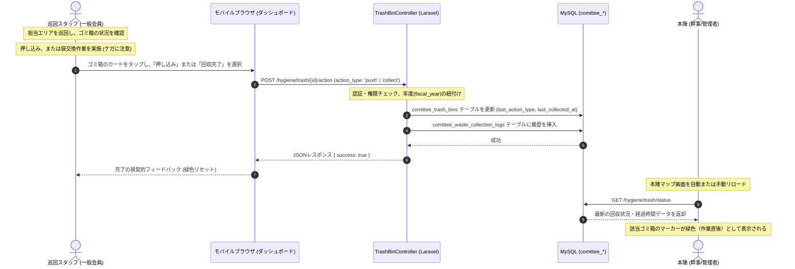

# 衛生管理サブシステム（ゴミ箱回収管理） 実装計画書

本計画書は、会場内のゴミ箱の回収状況をリアルタイムで共有し、効率的かつ安全な回収・清掃活動を支援する「衛生管理サブシステム（衛生管理モジュール）」を実装するための開発ステップを定義する。プログラムの実装自体は行わず、設計・計画のみを提示する。

---

## 1. システム構成・処理フロー

本サブシステムは、Laravel（バックエンド/Bladeテンプレート）、MySQL（データベース）、Bootstrap + Vanilla JS（フロントエンド）の既存スタックに統合する。

### 1.1 ゴミ回収・作業報告フロー
巡回スタッフがスマートフォンからゴミ箱の作業（押し込み、または回収・交換）を登録し、本陣や他スタッフへリアルタイムで共有するまでの処理フローを以下に示す。



---

## 2. データベースマイグレーション設計

既存データベースに、以下の3つのテーブルを追加する。テーブル接頭辞 `comittee_` を使用する。

### 2.1 `comittee_trash_bins` テーブルの作成
```php
Schema::create('comittee_trash_bins', function (Blueprint $table) {
    $table->id();
    $table->smallInteger('fiscal_year')->index(); // 開催年度
    $table->string('bin_code', 20); // BIN-01 などの識別コード
    $table->string('name', 100); // 設置場所等の名称
    $table->string('location_description', 255)->nullable(); // 周辺目印など
    $table->double('x_position'); // デジタル配置地図上のX座標 (%)
    $table->double('y_position'); // デジタル配置地図上のY座標 (%)
    $table->boolean('is_recovery_point')->default(false); // 集積場フラグ
    $table->smallInteger('default_warning_minutes')->default(45); // デフォルト警告しきい値(分)
    $table->smallInteger('default_full_minutes')->default(90); // デフォルト満杯しきい値(分)
    $table->enum('last_action_type', ['push', 'collect'])->nullable(); // 最終アクション
    $table->timestamp('last_collected_at')->nullable(); // 最終回収日時
    $table->timestamps();

    $table->unique(['fiscal_year', 'bin_code']); // 同一年度内でコードの一意性を保証
});
```

### 2.2 `comittee_trash_bin_threshold_rules` テーブルの作成
```php
Schema::create('comittee_trash_bin_threshold_rules', function (Blueprint $table) {
    $table->id();
    $table->smallInteger('fiscal_year')->index();
    $table->unsignedBigInteger('trash_bin_id')->nullable(); // NULLの場合はグローバル（全体）ルール
    $table->time('start_time'); // 適用開始時刻
    $table->time('end_time'); // 適用終了時刻
    $table->smallInteger('warning_minutes'); // 警告（黄）しきい値（分）
    $table->smallInteger('full_minutes'); // 満杯（赤）しきい値（分）
    $table->timestamps();

    $table->foreign('trash_bin_id')
          ->references('id')->on('comittee_trash_bins')
          ->onDelete('cascade');
});
```

### 2.3 `comittee_waste_collection_logs` テーブルの作成
```php
Schema::create('comittee_waste_collection_logs', function (Blueprint $table) {
    $table->id();
    $table->unsignedBigInteger('trash_bin_id');
    $table->unsignedBigInteger('user_id'); // 操作したユーザー
    $table->enum('action_type', ['push', 'collect']); // 'push' (押し込み), 'collect' (回収完了)
    $table->timestamp('recorded_at');
    $table->string('notes', 255)->nullable();
    $table->timestamps();

    $table->foreign('trash_bin_id')
          ->references('id')->on('comittee_trash_bins')
          ->onDelete('cascade');
    $table->foreign('user_id')
          ->references('id')->on('comittee_users') // 既存のユーザーテーブル名
          ->onDelete('cascade');
});
```

---

## 3. 影響コンポーネントと実装ステップ

### ステップ 1: ルーティング定義
* **[routes/web.php](file:///opt/project/syukuba-executive-committee/routes/web.php) の更新**:
  - 一般スタッフ用ルートと、幹事・管理者用ルート（ミドルウェア `kanji` 制限）に分けてルーティングを定義する。

```php
Route::middleware(['auth', 'approved'])->prefix('hygiene')->name('hygiene.')->group(function () {
    // 衛生班モバイルダッシュボード・マニュアル
    Route::get('/', [HygieneDashboardController::class, 'index'])->name('dashboard');
    Route::get('/manual', [HygieneManualController::class, 'show'])->name('manual');

    // ゴミ回収・作業報告API
    Route::post('/trash/{id}/action', [TrashBinController::class, 'reportAction'])->name('trash.action');
    Route::get('/trash/status', [TrashBinController::class, 'getStatusApi'])->name('trash.status');

    // 幹事・管理者用管理画面
    Route::middleware(['kanji'])->group(function () {
        Route::resource('bins', TrashBinManageController::class)->except(['show']);
        Route::resource('threshold-rules', TrashBinThresholdRuleController::class)->except(['show']);
        Route::get('/analytics', [HygieneAnalyticsController::class, 'index'])->name('analytics');
    });
});
```

### ステップ 2: モデルクラスの実装とリレーション定義

* **`TrashBin` モデル (`app/Models/TrashBin.php`)**:
  - `comittee_trash_bins` テーブルに対応。
  - **リレーション定義**:
    - `logs()`: `hasMany(WasteCollectionLog::class)`
    - `thresholdRules()`: `hasMany(TrashBinThresholdRule::class)`
  - **しきい値算出メソッドの実装**:
    - 現在時刻に合致する `TrashBinThresholdRule` が存在する場合はそのしきい値を使用し、存在しない場合は `default_warning_minutes` / `default_full_minutes` を使用して警告判定（緑・黄・赤）を行うヘルパーメソッド `getCurrentStatusColor()` をモデルに実装する。

* **`TrashBinThresholdRule` モデル (`app/Models/TrashBinThresholdRule.php`)**:
  - `comittee_trash_bin_threshold_rules` テーブルに対応。
  - `trashBin()`: `belongsTo(TrashBin.class)`

* **`WasteCollectionLog` モデル (`app/Models/WasteCollectionLog.php`)**:
  - `comittee_waste_collection_logs` テーブルに対応。
  - `trashBin()`: `belongsTo(TrashBin.class)`
  - `user()`: `belongsTo(User.class)`

---

### ステップ 3: コントローラの実装

* **`HygieneDashboardController.php`**:
  - モバイルダッシュボード画面を表示する。
  - 現在アクティブな年度（`fiscal_year`）に登録されているゴミ箱リスト（集積場を除く）を取得し、各ゴミ箱の「経過時間に基づく現在ステータス（カラー）」を判定してビューに渡す。

* **`TrashBinController.php`**:
  - `reportAction(Request $request, $id)`: 
    - ユーザーがゴミ箱のカードから「押し込み（`push`）」または「回収完了（`collect`）」を実行した際の非同期APIアクション。
    - トランザクションを張り、`comittee_trash_bins` テーブルの最終回収日時等の更新と、`comittee_waste_collection_logs` へのログ記録を一気に行う。
  - `getStatusApi(Request $request)`:
    - 本陣マップ等でゴミ箱のステータスをリアルタイムに更新するためのJSONデータ返却API。

* **`TrashBinThresholdRuleController.php`**:
  - 幹事向けにしきい値（時間帯別）ルールを設定するCRUDコントローラ。

* **`HygieneManualController.php`**:
  - 衛生班のデジタル作業マニュアルを表示する。

---

### ステップ 4: フロントエンド画面（Blade / JS）の構築

#### 1. 衛生班モバイルダッシュボード (`resources/views/hygiene/dashboard.blade.php`)
- **スマートフォン最適化**:
  - CSSフレームワークとしてBootstrapを使用。モバイル表示（Viewport）に合わせ、フォントサイズやボタンエリアを拡大。
  - ゴミ箱を「最後の作業からの経過時間が長い順（＝赤色の危険度が高い順）」にソートしてカード表示する。
- **作業入力UI**:
  - 各ゴミ箱カードをクリックするとアコーディオン風に開き、**「押し込み調整完了（青）」**と**「ゴミ袋回収・交換完了（緑）」**の2つの大きなボタンを表示する。
  - JavaScript（Vanilla JS）による非同期通信（`fetch`）でAPIへリクエストを送信し、成功時は該当カードの色を「通常（緑）」へ即座にリセットする。

#### 2. 現場デジタルマニュアル (`resources/views/hygiene/manual.blade.php`)
- コンテンツセキュリティポリシー（CSP）に適合させ、インラインスクリプト/インラインスタイルを一切使用せず、外部ファイルおよびBootstrap標準ユーティリティクラスのみで構成する。
- ゴミの押し込み作業時の「ガラス片・竹串によるケガ防止対策」を警告バナー（Bootstrapの `alert-danger` クラス等）を用いて目立たせる。

#### 3. しきい値ルール設定画面 (`resources/views/hygiene/threshold_rules/index.blade.php`)
- 幹事が「昼時の混雑期」や「ゴミ箱個別」の判定経過時間（分）を設定する画面。
- 入力値（時間帯、ゴミ箱、判定基準時間）が `comittee_trash_bin_threshold_rules` テーブルと連動して登録される。

---

## 4. テスト・検証計画

### 4.1 ユニットテスト
- **ステータス自動判定ロジックのテスト**:
  - `TrashBin` モデルのしきい値算出ロジックが、時間帯ルール（適用内・適用外）およびゴミ箱ごとの設定に則って正しく「緑」「黄」「赤」を返却するか確認するPHPUnitテストを実装する。

### 4.2 統合テスト (API・画面の確認)
- **非同期アクションテスト**:
  - 一般ユーザー（スタッフ）としてログインした状態で、`/hygiene/trash/{id}/action` にPOSTした際、データベースが正常に更新され、履歴ログが正しく作成されるかをテストコード（PHPUnitの `HTTP Tests`）で検証する。

### 4.3 動作検証・マニュアル検証
- **モバイル画面動作検証**:
  - Chrome / Safariのデベロッパーツールを用いてスマートフォン画面幅（375px〜430px）での表示崩れがないか、手袋をしていても押しやすいボタン幅が確保できているかを視覚的に確認する。
- **安全マニュアル確認**:
  - モバイルダッシュボードのフッター等からワンタップでデジタルマニュアル（ケガ防止警告付き）にアクセスできるか導線を確認する。
