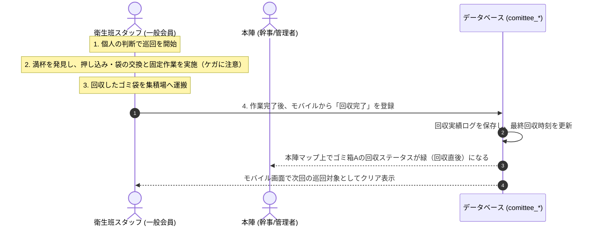

# 保土ケ谷宿場まつり実行委員会 実務管理総合システム 衛生管理サブシステム 仕様書

本書は、システム仕様書（[system_specifications.md](../system_common/system_specifications.md)）に基づき、イベント会場内の美観・清潔さを維持するための「衛生管理サブシステム（衛生管理モジュール）」の要件・業務フロー・データモデル・画面設計の詳細を定義する。

---

## 1. システム概要

衛生管理サブシステムは、まつり開催当日に会場内に設置されたゴミ箱（計8箇所＋回収所1箇所）の回収・清掃状況をリアルタイムで共有し、効率的な会場美化活動を支援するWebアプリケーションである。

### 1.1 衛生班の巡回・作業ワークフロー
本システムにおける衛生班の活動は、スタッフが自立して以下のサイクルを繰り返すシンプルなワークフローを基本とする。

1. **巡回開始**: 衛生班スタッフは、個人の判断で会場内の担当エリアの巡回を開始する。
2. **満杯ゴミ箱への作業**: 満杯のゴミ箱を見つけたら、その場で押し込み（容積圧縮）または回収（ゴミ袋の交換）を実施する。
3. **集積場への運搬**: 回収したゴミ袋は、**衛生班詰所横の集積場**へ持って行く。

スタッフは作業完了時（ゴミ箱の前、または集積場への運搬後）にスマートフォンからシステムへ報告を登録する。

本システムは以下の2つの主要機能から構成される。

1. **リアルタイムゴミ回収報告機能（当日本番フェーズ）**
   - 巡回スタッフが実施したゴミの押し込み・回収完了のアクションをスマートフォンから即座に報告し、本陣や他のスタッフと共有する仕組みを提供する。
   - 各ゴミ箱が「前回の回収から経過した時間」に応じて自動的に色分け警告（緑 ➡️ 黄 ➡️ 赤）される。この**警告判定のしきい値（時間）は、ゴミ箱の設置場所や時間帯（ピーク時・閑散時）に応じて細かく制御可能**とする。
   - ゴミは最終的に事業者に有料（袋単位等）で処分を委託するため、**ゴミの押し込みや分別徹底によりゴミ袋内の密度を高め、回収袋数を最小限に抑えることで処分コストを削減する**ことを目指す。
2. **現場マニュアル閲覧機能**
   - 衛生班スタッフに対し、現場でのゴミ袋固定ルールや分別ルール（プラ容器の重ね方、箸・串のまとめ方）、コスト削減のための効率的な回収要領、および安全に作業するためのケガ防止対策をいつでもスマートフォンから参照できるデジタルマニュアルを提供する。

---

## 2. 権限・アクセス制御

本システム内の機能は、会員種別（ロール）に応じて以下の通りアクセス制限を行う。

| 機能 | システム管理 (`admin`) / 幹事 (`kanji`) | 一般会員 (`general`) ※衛生班スタッフ |
| :--- | :--- | :--- |
| **ゴミ箱マスタ管理** | ゴミ箱の新規設置・位置編集・削除 | 閲覧のみ |
| **警告しきい値ルール設定** | ゴミ箱・時間帯ごとの経過時間しきい値の編集・登録 | 閲覧のみ |
| **ゴミ回収・作業報告** | 全ゴミ箱の最終回収時刻・状態の閲覧 | 自身が作業したゴミ箱の回収完了・状態報告 |
| **巡回スケジュール管理** | シフトの登録・編集・メンバー割当 | 自身のシフト閲覧 |
| **回収ログ・統計分析** | ログの閲覧、CSVエクスポート | 閲覧不可 |
| **現場マニュアル閲覧** | 閲覧可能 | 閲覧可能（ショートカット配置） |

---

## 3. 業務フローとユースケース

### 3.1 ゴミ箱巡回・その場回収フロー
1. **巡回開始**: 衛生班の巡回スタッフ（一般会員）は、個人の判断で会場内の巡回を開始する。
2. **満杯の発見と作業（その場での実施）**:
   - 巡回中にゴミ箱が満杯になっている、またはゴミが溢れそうになっているのを発見する。
   - **発見した巡回スタッフが、以下の作業（ゴミの圧縮・回収・交換）を行う。**
     - **押し込みによる容量確保**: 見た目が満杯であっても、**ゴミを押し込んだり、隙間を埋めるなどしてなるべく空き容量を確保**する。
       - > [!CAUTION]
         > **押し込み時のケガ防止**: ゴミ袋の中にはガラス片や竹串・箸などが混入しています。押し込みの際にこれらが手袋を突き破り、**切り傷や刺し傷などのケガ**をする危険性があるため、絶対に素手で行わず、無理に力をかけずに慎重に行ってください。
     - **袋の交換**: 安全に配慮しつつ、なるべく袋の中の空き容量を減らした状態で袋の口を縛って回収し、新しい袋を設置する。
     - **分別補助・固定**: プラ重ねや箸のコップまとめ等の分別を行い、新しいゴミ袋はガムテープで4〜6か所固定する。
3. **ゴミの運搬**: 
   - 回収（交換）したゴミ袋は、**衛生班詰所横の集積場**に持って行く。
4. **回収・作業完了報告**: 
   - 作業完了後（作業したゴミ箱の前、または集積場へ運搬したタイミングで）、スタッフはスマートフォンから該当のゴミ箱を選択し、「回収・交換完了（またはステータスを正常にリセット）」または「押し込み調整完了」を登録する。
5. **情報のリアルタイム共有**: 
   - 登録と同時にデータベースが更新され、本陣のマップ画面上で該当ゴミ箱の「最終回収時刻」が更新され、ステータス表示が**緑色（通常/清掃済）**になる。これにより、本陣や他の巡回スタッフは、各ゴミ箱の最新状態（いつ・誰によって作業されたか）をリアルタイムに把握でき、巡回ルートの無駄な重複や確認漏れを防ぐことができる。



---

## 4. 機能詳細

### 4.1 リアルタイムゴミ回収・作業報告（モバイル特化）
- **作業ステータスと報告方式**:
  - 巡回スタッフは、各ゴミ箱に対して「押し込み調整のみ実施」または「ゴミ袋の回収・交換完了」のいずれかの作業結果を選択して登録できる。
- **動的しきい値による警告表示（場所と時間帯の制御）**:
  - 各ゴミ箱のステータス（緑/黄/赤）は、前回の回収報告から経過した時間と、設定された「警告しきい値」を比較して自動判定される。
  - 警告しきい値は、**「設置場所（ゴミ箱ごと）」**および**「時間帯」**により動的に制御される。
    - *例（場所別）*: 人通りが多くゴミが溜まりやすい「混雑エリア」に設置されたゴミ箱は、通常よりしきい値を短く設定し（例：20分経過で黄、40分経過で赤）、比較的利用者が少ない「閑散エリア」のゴミ箱は、しきい値を長めに設定する（例：60分経過で黄、120分経過で赤）。
    - *例（時間帯別）*: 昼食時などの混雑ピーク時（11:30〜13:30）は、自動的に全ゴミ箱の警告しきい値を短縮（例：一律でしきい値を50%削減）し、より頻繁な巡回を促す。
  - 長期間巡回・作業報告がないゴミ箱はマップ上で赤く強調され、見落としを防止する。
- **モバイル簡易UI**: 現場スタッフが作業直後、手袋を着用した状態でも片手で操作しやすいよう、ボタンサイズを大きく設計。マップ上のピンまたはリストからゴミ箱をタップし、作業内容をワンタップするだけで完了する。
- **ゴミ箱詳細情報**: 各ゴミ箱をタップすると、周辺の目印（例: 「セブンイレブン前」「キッズ村入口」など）が表示され、不慣れなスタッフでも迷わずにゴミ箱の位置を特定できる。

### 4.2 衛生班デジタルマニュアル
現地スタッフがスマートフォンからいつでも確認できる「現場用クイックマニュアル」を表示する。

- **主なマニュアル内容**:
  1. **効率的な回収によるコスト削減（重要ルール）**:
     - ゴミの処分は最終的に処理業者へ有料で委託します。回収袋数が増えるほど処分コストが高くなるため、**「ゴミ袋の数を極力減らすこと」**が重要課題です。
     - 見た目が満杯に見えてもすぐに交換せず、**上から押し込んだり、隙間を詰めてなるべく空き容量を確保**してください。
     - ただし、袋が破れないよう安全に配慮しつつ、なるべく袋の中の空き容量を減らしてから袋を閉じてください。
  2. **回収ゴミの搬入先（集積場）**:
     - 回収・交換したゴミ袋は、そのまま放置せず、速やかに**「衛生班詰所横の集積場」**まで運搬してください。
  3. **ゴミ袋の設置ルール**: ガムテープで4〜6か所を確実に固定すること（風飛び防止）。
  4. **分別の徹底**: 竹串や箸は、ゴミ袋の破れを防止するために必ず「使用済みの紙コップ」にまとめてから捨てること。
  5. **省スペース化**: 紙コップやプラ容器は、重ねて捨てることでゴミ袋内の容積を減らすこと。
  6. **安全対策とケガ防止（超重要ルール）**:
     - 作業時は衛生管理およびケガ防止のため、**必ず手袋を着用**してください。
     - 特に**ゴミの押し込み作業時**は、ゴミ袋内のガラス片（切り傷の原因）や、竹串・割箸（刺し傷の原因）が手を突き刺す危険性があります。
     - 手の平で強く真下に押し込む動作は非常に危険です。安全を確認しながら横から隙間を埋めるように整えるか、あるいは道具・厚手の保護具を介して行うなど、ケガに細心の注意を払って作業を行ってください。

---

## 5. データベース設計

共通のテーブル接頭辞 `comittee_` を使用し、`fiscal_year`（開催年度）をキーとしてデータを管理する。

### 5.1 `comittee_trash_bins`（ゴミ箱マスタ）
会場内のゴミ箱の設置場所および現在の状態を管理する。

| カラム名 | データ型 | 制約 | 説明 |
| :--- | :--- | :--- | :--- |
| `id` | BigInt | PK, Auto Increment | ゴミ箱ID |
| `fiscal_year` | SmallInt | Not Null | 開催年度 |
| `bin_code` | Varchar(20) | Not Null | ゴミ箱コード（例: `BIN-01`, `RECOVERY-01`） |
| `name` | Varchar(100) | Not Null | ゴミ箱の名称（例: 「セブンイレブン前ゴミ箱」） |
| `location_description` | Varchar(255) | Nullable | 設置場所の補足説明（例: 「本陣より東へ50m、電柱横」） |
| `x_position` / `y_position` | Double | Not Null | デジタル配置地図上のX, Yパーセント座標 |
| `is_recovery_point` | Boolean | Not Null, Default `false` | 回収集積所（集積場）かどうかのフラグ |
| `default_warning_minutes` | SmallInt | Not Null, Default `45` | デフォルトの警告（黄）しきい値時間（分） |
| `default_full_minutes` | SmallInt | Not Null, Default `90` | デフォルトの満杯（赤）しきい値時間（分） |
| `last_action_type` | Enum | Nullable | 最終作業種別（`'push'`, `'collect'`） |
| `last_collected_at` | Timestamp | Nullable | 最終回収・作業完了日時 |

### 5.2 `comittee_trash_bin_threshold_rules`（警告しきい値スケジュールルール設定）
時間帯やゴミ箱ごとの警告判定時間を細かくコントロールする設定テーブル。

| カラム名 | データ型 | 制約 | 説明 |
| :--- | :--- | :--- | :--- |
| `id` | BigInt | PK, Auto Increment | ルールID |
| `fiscal_year` | SmallInt | Not Null | 開催年度 |
| `trash_bin_id` | BigInt | Nullable, FK | `comittee_trash_bins.id` への外部キー（特定のゴミ箱に適用。NULLの場合は全ゴミ箱に適用する共通のスケジュールルール） |
| `start_time` | Time | Not Null | 適用開始時刻（例: `'11:30:00'`） |
| `end_time` | Time | Not Null | 適用終了時刻（例: `'13:30:00'`） |
| `warning_minutes` | SmallInt | Not Null | 警告（黄）しきい値（分、前回の回収からの経過時間） |
| `full_minutes` | SmallInt | Not Null | 満杯（赤）しきい値（分、前回の回収からの経過時間） |
| `created_at` / `updated_at` | Timestamp | Nullable | 作成・更新日時 |

### 5.3 `comittee_waste_collection_logs`（ゴミ回収・作業ログ）
いつ、誰が、どのゴミ箱の作業（押し込み、または回収）を行ったかの履歴を保存する。

| カラム名 | データ型 | 制約 | 説明 |
| :--- | :--- | :--- | :--- |
| `id` | BigInt | PK, Auto Increment | ログID |
| `trash_bin_id` | BigInt | Not Null, FK | `comittee_trash_bins.id` への外部キー |
| `user_id` | BigInt | Not Null, FK | `comittee_users.id` への外部キー |
| `action_type` | Enum | Not Null | アクション種別（`'push'`, `'collect'`） |
| `recorded_at` | Timestamp | Not Null | 記録日時 |
| `notes` | Varchar(255) | Nullable | 現場メモ |

---

## 6. ルーティング設計

Laravelの認証および一般会員/幹事ミドルウェアを適用したルーティング設計を行う。

```php
Route::middleware(['auth', 'approved'])->prefix('hygiene')->name('hygiene.')->group(function () {
    
    // 【共通】モバイルダッシュボード・マニュアル閲覧
    Route::get('/', [HygieneDashboardController::class, 'index'])->name('dashboard');
    Route::get('/manual', [HygieneManualController::class, 'show'])->name('manual');

    // 【一般会員・スタッフ用】現場での回収・作業報告API
    Route::prefix('trash')->name('trash.')->group(function () {
        Route::get('/status', [TrashBinController::class, 'getStatusApi'])->name('api.status');
        Route::post('/{id}/action', [TrashBinController::class, 'reportAction'])->name('action');
    });

    // 【幹事・管理者専用】マスタ設定・警告ルール設定
    Route::middleware(['kanji'])->group(function () {
        // ゴミ箱マスタ設定
        Route::resource('bins', TrashBinManageController::class)->except(['show']);
        
        // 警告しきい値ルール設定 (混雑・時間帯コントロール用)
        Route::resource('threshold-rules', TrashBinThresholdRuleController::class)->except(['show']);
        
        // 回収統計データ分析
        Route::get('/analytics', [HygieneAnalyticsController::class, 'index'])->name('analytics');
    });
});
```

---

## 7. 画面設計（UI/UX）方針

### 7.1 衛生班モバイルダッシュボード（一般会員向け）
- **スマートフォンファースト**: 画面の横幅375px〜430pxに完全最適化。
- **ゴミ箱簡易リスト（動的しきい値による時間カラー表示）**:
  - 各ゴミ箱が「最後の回収から経過した時間」をもとに自動的に色分け（緑・黄・赤）されて表示される。
  - この経過時間判定は、現在時刻が「しきい値ルール」に該当している場合、自動で短い判定時間（混雑時用）に切り替わる。
- **巨大なクイックアクションボタン**:
  - リストのゴミ箱カードをタップすると、「押し込み調整（`push`）」と「回収・交換完了（`collect`）」の2つの巨大なボタンが表示され、作業完了後にその場でワンタップ登録が可能。

### 7.2 警告しきい値ルール設定画面（幹事・管理者向け）
- **時間帯別パラメータコントロールUI**:
  - まつりのタイムスケジュールに沿って、特定の時間帯や特定のゴミ箱を対象としたしきい値（警告時間・満杯時間）を設定できる管理画面を提供する。
  - ピーク時間帯（例：ござ市が賑わう昼時など）を「イベント時間帯ルール」として追加・編集でき、入力した開始・終了時間としきい値時間がデータベース（`comittee_trash_bin_threshold_rules`）に保存される。

---

## 8. 改訂履歴
- 2026-06-30: 新規作成。第34回宿場まつりの衛生マニュアル・ゴミ分別ルールをシステム仕様に統合（初版）
- 2026-06-30: 食品衛生管理（検便・届出）機能を仕様から除外、ゴミ回収管理およびマニュアル機能に特化（第2版）
- 2026-06-30: ゴミ処分コスト削減を目的とした「ゴミ袋の限界詰め込み（押し込み）」ルールをシステム概要、業務フロー、デジタルマニュアルに追記（第3版）
- 2026-06-30: 押し込み作業時に発生しうるケガ（ガラス片による切り傷、串による刺し傷）の防止に関する注意事項を業務フローおよびデジタルマニュアルに追記（第4版）
- 2026-06-30: 安全性を最優先し、ゴミの詰め込みについて「限界まで」や「まんぱんに」といった強い表現を「なるべく」「可能な範囲で」などの柔らかい表現に修正（第5版）
- 2026-06-30: 警備用の「安全巡回」と衛生班による「ゴミ箱管理に特化した巡回」を明確に区別し、防犯・安全に関わる緊急報告機能をシステム要件から削除（第6版）
- 2026-06-30: 巡回スタッフ自身がその場で押し込み・回収作業を完結させる運用実態に合わせ、二重報告を排した「その場回収・作業完了報告」を基本とする業務フローとデータモデルに改訂（第7版）
- 2026-06-30: 「個人の判断で巡回 ➡️ 発見・作業 ➡️ 詰所横の集積場へ運搬」という一連のリアルな現場ワークフローをシステム概要、業務フロー、デジタルマニュアル（集積場への搬入ルール追加）、およびシーケンス図に完全に反映（第8版）
- 2026-06-30: 「発見した巡回スタッフ自身がその場で直ちに全作業（押し込み、交換、運搬、報告）を行う」主客の統一性を業務フローの文章およびシーケンス図の注記において徹底する修正を実施（第9版）
- 2026-06-30: 押し込み・回収時の表現の強さを緩和するため、「スタッフ自身が」「その場から離れず直ちに」などの強調表現を削除し、より柔らかい表現に修正（第10版）
- 2026-06-30: 警告色分けの判定時間をゴミ箱の設置場所、混雑時間帯、閑散状況に合わせて細かくコントロールするため、動的しきい値（スケジュールルール）テーブルを追加し、管理UIおよび自動判定仕様を追記（第11版）
- 2026-06-30: しきい値制御の説明において、実態と異なる具体的な場所名の記述を「混雑エリア」「閑散エリア」などの汎用的な表現に変更（第12版）
