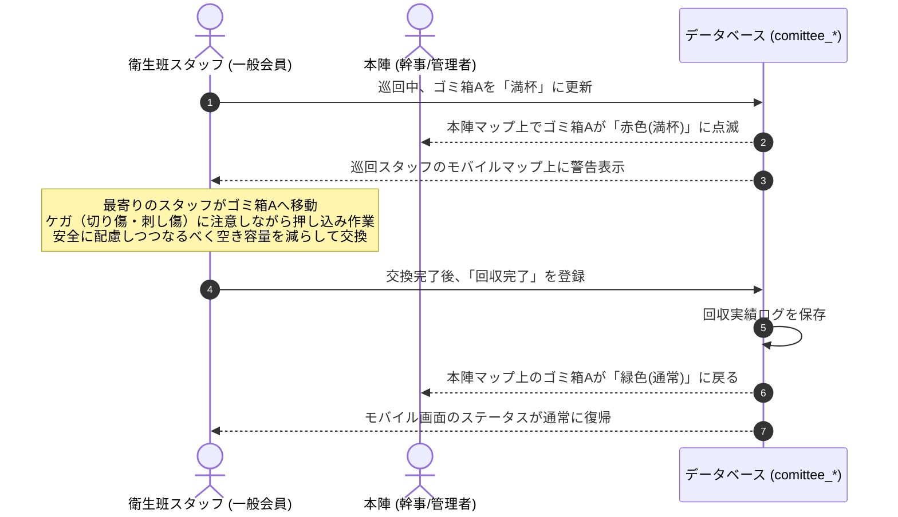

# 保土ケ谷宿場まつり実行委員会 実務管理総合システム 衛生管理サブシステム 仕様書

本書は、システム仕様書（[system_specifications.md](../system_common/system_specifications.md)）に基づき、イベント会場内の美観・清潔さを維持するための「衛生管理サブシステム（衛生管理モジュール）」の要件・業務フロー・データモデル・画面設計の詳細を定義する。

---

## 1. システム概要

衛生管理サブシステムは、まつり開催当日に会場内に設置されたゴミ箱（計8箇所＋回収所1箇所）の満杯状況をリアルタイムで共有し、効率的な回収巡回を支援するWebアプリケーションである。本システムは以下の2つの主要機能から構成される。

1. **リアルタイムゴミ回収管理機能（当日本番フェーズ）**
   - 衛生班スタッフの巡回をサポートし、ゴミ箱の満杯ステータスをスマートフォンから即座に報告・共有できる仕組みを提供する。
   - ゴミは最終的に事業者に有料（袋単位等）で処分を委託するため、**ゴミの押し込みや分別徹底によりゴミ袋内の密度を高め、回収袋数を最小限に抑えることで処分コストを削減する**ことを目指す。
2. **現場マニュアル閲覧機能**
   - 衛生班スタッフに対し、現場でのゴミ袋固定ルールや分別ルール（プラ容器の重ね方、箸・串のまとめ方）、コスト削減のための効率的な回収要領、および安全に作業するためのケガ防止対策をいつでもスマートフォンから参照できるデジタルマニュアルを提供する。

---

## 2. 権限・アクセス制御

本システム内の機能は、会員種別（ロール）に応じて以下の通りアクセス制限を行う。

| 機能 | システム管理 (`admin`) / 幹事 (`kanji`) | 一般会員 (`general`) ※衛生班スタッフ |
| :--- | :--- | :--- |
| **ゴミ箱マスタ管理** | ゴミ箱の新規設置・位置編集・削除 | 閲覧のみ |
| **ゴミ箱満杯報告** | 報告状況の閲覧、強制ステータス更新 | 担当エリアのゴミ箱ステータス更新 |
| **ゴミ回収完了報告** | 回収状況の閲覧、ステータスリセット | 回収完了の登録・報告 |
| **巡回シフト・スケジュール管理** | シフトの登録・編集・メンバー割当 | 自身のシフト閲覧 |
| **回収ログ・統計分析** | ログの閲覧、CSVエクスポート | 閲覧不可 |
| **現場マニュアル閲覧** | 閲覧可能 | 閲覧可能（ショートカット配置） |

---

## 3. 業務フローとユースケース

### 3.1 ゴミ回収管理フロー
1. **衛生班の巡回**: 衛生班スタッフ（一般会員）はスマートフォンで「衛生班モバイルダッシュボード」を開き、巡回を開始する。
2. **満杯報告**: 巡回中、特定のゴミ箱が満杯になっている、または溢れそうになっているのを発見した場合、モバイル画面上で該当のゴミ箱をタップし「満杯（要回収）」ステータスに更新する。
3. **アラート共有**: ステータス更新により、本陣（本部）の全体マップ画面および巡回中の他スタッフの画面で、該当ゴミ箱が**赤色（満杯）**に変化する。
4. **圧縮・回収・交換**:
   - 最寄りのスタッフがゴミ箱へ向かう。
   - 見た目が満杯になっていてもすぐに袋を回収せず、**ゴミを押し込んだり、隙間を埋めるなどしてなるべく空き容量を確保**する。
     - > [!CAUTION]
       > **押し込み時のケガ防止**: ゴミ袋の中にはガラス片や竹串・箸などが混入しています。押し込みの際にこれらが手袋を突き破り、**切り傷や刺し傷などのケガ**をする危険性があるため、絶対に素手で行わず、無理に力をかけずに慎重に行ってください。
   - 袋が破れないよう安全に配慮しつつ、なるべく袋の中の空き容量を減らしてから袋の口を縛って回収・交換する。
   - 交換時はマニュアルに従って、プラ重ねや箸のコップまとめ等の分別補助も行う。
5. **回収完了登録**: 新しいゴミ袋の設置およびガムテープでの固定が完了した後、モバイル画面から「回収完了（空に戻す）」をタップする。
6. **ログ蓄積**: 回収完了登録に伴い、ゴミ箱ID、回収日時、担当スタッフIDが自動でデータベースに記録される。



---

## 4. 機能詳細

### 4.1 リアルタイムゴミ回収支援（モバイル特化）
- **ゴミ箱ステータス（3段階）**:
  - `0: Empty/Normal` (青/緑): 空または十分に余裕がある状態。
  - `1: Warning` (黄): 半分以上埋まっており、次の巡回での回収を推奨する状態。
  - `2: Full` (赤): 満杯またはゴミが溢れており、即時回収が必要な状態。
- **モバイル簡易UI**: 現場スタッフが手袋を着用した状態でも操作しやすいよう、ボタンサイズを大きく設計。マップ上のピンまたはリストからゴミ箱をタップするだけでステータスを変更可能にする。
- **ゴミ箱詳細情報**: 各ゴミ箱をタップすると、周辺の目印（例: 「セブンイレブン前」「キッズ村入口」など）が表示され、不慣れなボランティアスタッフでも迷わずに現場に到着できるようにする。

### 4.2 衛生班デジタルマニュアル
現地スタッフがスマートフォンからいつでも確認できる「現場用クイックマニュアル」を表示する。インラインCSS/Scriptの禁止規則に従い、外部JS/CSSで動作するレスポンシブなビューアとして実装する。

- **主なマニュアル内容**:
  1. **効率的な回収によるコスト削減（重要ルール）**:
     - ゴミの処分は最終的に処理業者へ有料で委託します。回収袋数が増えるほど処分コストが高くなるため、**「ゴミ袋の数を極力減らすこと」**が重要課題です。
     - 見た目が満杯に見えてもすぐに交換せず、**上から押し込んだり、隙間を詰めてなるべく空き容量を確保**してください。
     - ただし、袋が破れないよう安全に配慮しつつ、なるべく袋の中の空き容量を減らしてから袋を閉じてください。
  2. **ゴミ袋の設置ルール**: ガムテープで4〜6か所を確実に固定すること（風飛び防止）。
  3. **分別の徹底**: 竹串や箸は、ゴミ袋の破れを防止するために必ず「使用済みの紙コップ」にまとめてから捨てること。
  4. **省スペース化**: 紙コップやプラ容器は、重ねて捨てることでゴミ袋内の容積を減らすこと。
  5. **安全対策とケガ防止（超重要ルール）**:
     - 作業時は衛生管理およびケガ防止のため、**必ず手袋を着用**してください。
     - 特に**ゴミの押し込み作業時**は、ゴミ袋内のガラス片（切り傷の原因）や、竹串・割箸（刺し傷の原因）が手を突き刺す危険性があります。
     - 手の平で強く真下に押し込む動作は非常に危険です。安全を確認しながら横から隙間を埋めるように整えるか、あるいは道具・厚手の保護具を介して行うなど、ケガに細心の注意を払って作業を行ってください。

---

## 5. データベース設計

共通のテーブル接頭辞 `comittee_` を使用し、`fiscal_year`（開催年度）をキーとしてデータを管理する。

### 5.1 `comittee_trash_bins`（ゴミ箱マスタ）
会場内のゴミ箱の設置場所を管理する。地図モジュール（`comittee_map_markers`）と物理座標で連動可能にする。

| カラム名 | データ型 | 制約 | 説明 |
| :--- | :--- | :--- | :--- |
| `id` | BigInt | PK, Auto Increment | ゴミ箱ID |
| `fiscal_year` | SmallInt | Not Null | 開催年度 |
| `bin_code` | Varchar(20) | Not Null | ゴミ箱コード（例: `BIN-01`, `RECOVERY-01`） |
| `name` | Varchar(100) | Not Null | ゴミ箱の名称（例: 「セブンイレブン前ゴミ箱」） |
| `location_description` | Varchar(255) | Nullable | 設置場所の補足説明（例: 「本陣より東へ50m、電柱横」） |
| `latitude` / `longitude` | Double | Nullable | GPS座標（将来的なモバイルマップナビ用） |
| `x_position` / `y_position` | Double | Not Null | デジタル配置地図上のX, Yパーセント座標（0.00〜100.00） |
| `is_recovery_point` | Boolean | Not Null, Default `false` | 回収集積所（ゴミステーション）かどうかのフラグ |
| `current_status` | TinyInt | Not Null, Default `0` | 現在の満杯ステータス（`0`:通常, `1`:要注意, `2`:満杯） |
| `last_reported_at` | Timestamp | Nullable | 最終ステータス更新日時 |
| `created_at` / `updated_at` | Timestamp | Nullable | 作成・更新日時 |

### 5.2 `comittee_waste_collection_logs`（ゴミ回収ログ）
いつ、誰が、どのゴミ箱の回収・ステータス更新を行ったかの履歴を保存する。これにより来年度以降のゴミ箱配置最適化データを蓄積する。

| カラム名 | データ型 | 制約 | 説明 |
| :--- | :--- | :--- | :--- |
| `id` | BigInt | PK, Auto Increment | ログID |
| `trash_bin_id` | BigInt | Not Null, FK | `comittee_trash_bins.id` への外部キー（ゴミ箱） |
| `user_id` | BigInt | Not Null, FK | `comittee_users.id` への外部キー（操作した会員） |
| `action_type` | Enum | Not Null | アクション種別（`'report_full'`（満杯報告）, `'report_warning'`（注意報告）, `'collect'`（回収完了）） |
| `recorded_at` | Timestamp | Not Null | 記録日時 |
| `notes` | Varchar(255) | Nullable | 「プラ容器の混入多し」「袋破れあり」などの作業時のメモ |

---

## 6. ルーティング設計

Laravelの認証および一般会員/幹事ミドルウェアを適用したルーティング設計を行う。

```php
Route::middleware(['auth', 'approved'])->prefix('hygiene')->name('hygiene.')->group(function () {
    
    // 【共通】モバイルダッシュボード・マニュアル閲覧
    Route::get('/', [HygieneDashboardController::class, 'index'])->name('dashboard');
    Route::get('/manual', [HygieneManualController::class, 'show'])->name('manual');

    // 【一般会員・スタッフ用】リアルタイムゴミ回収ステータス更新
    Route::prefix('trash')->name('trash.')->group(function () {
        Route::get('/status', [TrashBinController::class, 'getStatusApi'])->name('api.status');
        Route::post('/{id}/report', [TrashBinController::class, 'reportStatus'])->name('report');
        Route::post('/{id}/collect', [TrashBinController::class, 'completeCollection'])->name('collect');
    });

    // 【幹事・管理者専用】マスタ設定
    Route::middleware(['kanji'])->group(function () {
        // ゴミ箱マスタ設定
        Route::resource('bins', TrashBinManageController::class)->except(['show']);
        
        // 回収統計データ分析
        Route::get('/analytics', [HygieneAnalyticsController::class, 'index'])->name('analytics');
    });
});
```

---

## 7. 画面設計（UI/UX）方針

### 7.1 衛生班モバイルダッシュボード（一般会員向け）
- **スマートフォンファースト**: 画面の横幅375px〜430px（iPhone/Android端末）に完全最適化。
- **ゴミ箱簡易リスト（ステータスカラー表示）**:
  - 各ゴミ箱が「満杯（赤）」「要注意（黄）」「通常（緑）」で色分けされたカード形式でリスト表示される。
  - 最も緊急性の高い「赤（満杯）」が自動的に最上部にソートされる。
- **巨大なアクションボタン**:
  - ゴミ箱カードをタップすると展開し、「空にする」「要注意（半分）」「満杯！」の3つの巨大なボタンが表示される。手袋をはめた屋外作業でも、押し間違いがない大きさ（最小タッチエリア 48px × 48px）を確保する。
- **マニュアルへのクイックアクセス**:
  - フッター部分に常時「ゴミ分別マニュアル」へのショートカットリンクを固定配置する。

---

## 8. 改訂履歴
- 2026-06-30: 新規作成。第34回宿場まつりの衛生マニュアル・ゴミ分別ルールをシステム仕様に統合（初版）
- 2026-06-30: 食品衛生管理（検便・届出）機能を仕様から除外、ゴミ回収管理およびマニュアル機能に特化（第2版）
- 2026-06-30: ゴミ処分コスト削減を目的とした「ゴミ袋の限界詰め込み（押し込み）」ルールをシステム概要、業務フロー、デジタルマニュアルに追記（第3版）
- 2026-06-30: 押し込み作業時に発生しうるケガ（ガラス片による切り傷、串による刺し傷）の防止に関する注意事項を業務フローおよびデジタルマニュアルに追記（第4版）
- 2026-06-30: 安全性を最優先し、ゴミの詰め込みについて「限界まで」や「まんぱんに」といった強い表現を「なるべく」「可能な範囲で」などの柔らかい表現に修正（第5版）
