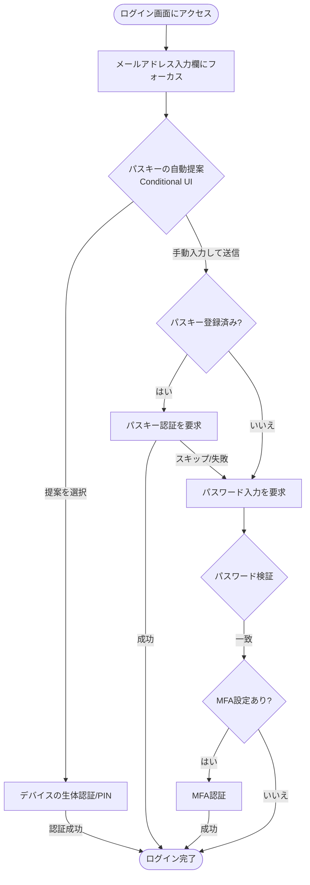

# 保土ケ谷宿場まつり実行委員会 実務管理総合システム ログイン・パスキー認証仕様書

本書は、システム仕様書（[system_specifications.md](file:///opt/project/syukuba-executive-committee/docs/system_specifications.md)）に基づき、パスキー（Passkey / WebAuthn）とパスワード認証を安全かつスムーズに併用するための認証フローおよびセキュリティ仕様を定義する。

---

## 1. ログインフローとUI/UX設計 (Passkey-First / Conditional UI)

ユーザーがパスキーの利便性を享受しつつ、従来のパスワードユーザーも迷わない**「パスキー優先（Passkey-First）」**かつ**「条件付きUI（Conditional UI）」**を採用した設計とする。

### 1.1 ログイン画面の挙動とユーザーインターフェース

1. **ID（メールアドレス）入力欄のフォーカス時 (Conditional UI)**:
   - ブラウザのオートフィル（自動補完）機能と連携し、登録済みのパスキー候補をキーボード上部や入力欄のドロップダウンで提案する。
   - ユーザーが候補を選択し、デバイスの生体認証（指紋・顔認証）またはPIN入力を行うことで、即座にログインが完了する。

2. **パスキー未登録または自動提案を使用しない場合のフロー**:
   - ユーザーは通常通りメールアドレスを入力し、「次へ」ボタンをクリックする。
   - バックエンドで該当アカウントに対するアクティブなパスキーの有無を判別する。
     - **パスキー登録あり**: ブラウザのパスキー認証ダイアログ（WebAuthn API）を自動的に起動し、生体認証を促す。パスキー認証が失敗またはスキップされた場合は、パスワード入力画面を表示する。
     - **パスキー登録なし**: 即座にパスワード入力欄を表示し、パスワード認証を要求する。

### 1.2 ログイン認証フロー図

---

## 2. アカウント登録・移行フローと権限管理

本システムでは、パスキーの登録・管理操作を「システム管理」グループ所属ユーザーのみに制限するセキュリティ方針を採用している。一方で、WebAuthnの仕様上、秘密鍵の生成および登録処理は対象ユーザーのデバイス上で行う必要がある。この制約とセキュリティ方針を両立するため、以下のステップで登録・移行を行う。

### 2.1 パスキー登録フロー（管理者制御モデル）

1. **管理者による登録セッションの発行**:
   - システム管理者が「パスキー管理画面」から対象ユーザーを指定し、「パスキー登録セッション開始（登録用ワンタイムURLの発行）」を実行する。
   - 登録用ワンタイムURLには、短時間のみ有効なワンタイムトークンが含まれる。

2. **ユーザーによるデバイス登録（WebAuthnプロセスの実行）**:
   - ユーザーは管理者から共有されたワンタイムURL、または管理者立ち会いのもとで専用登録画面にアクセスする。
   - デバイスの生体認証を登録し、公開鍵をサーバーへ送信する。
   - 登録完了後、ワンタイムトークンは無効化される。

### 2.2 アカウント移行と複数パスキーの登録

- **複数パスキー登録の対応**:
  - デバイスの紛失や機種変更時のログイン不能リスクを防ぐため、1つのアカウントに対し**複数のパスキー登録（例：スマートフォンとPCの双方）を許可**する。
  - 追加登録を行う場合も、上記と同様にシステム管理者が発行したセッションを通じて登録を行う。

---

## 3. 安全なアカウントリカバリー（リカバリー設計）

デバイスの紛失や破損によりパスキーでのログインができなくなった場合に備え、以下の安全なフォールバック・復旧手段を提供する。

1. **パスワード ＋ 多要素認証（MFA）による代替ログイン**:
   - パスキーが利用できない環境では、従来の「ID/パスワード」に加えて、事前登録されたメールアドレスまたはSMS宛てに送信されるワンタイムパスワード（MFA）を入力することでログインを許可する。

2. **バックアップ用リカバリーコードの発行**:
   - パスワードを使用しない完全パスレスアカウントや、万が一の全資格情報紛失に備え、初期登録時に使い捨ての「リカバリーコード（8〜12桁の英数字）」を発行し、厳重に保管するよう促す。

3. **システム管理者によるパスキーの無効化と再発行**:
   - デバイスの紛失申告があった場合、システム管理者が即座に対象のパスキーを無効化（削除）し、アカウントを一時的にパスワード＋MFAでのログインモードに切り替えるか、新しいパスキー登録用トークンを発行する。

---

## 4. バックエンド設計とセキュリティ要件

### 4.1 認証情報の保証レベル（LoA: Level of Assurance）の区別
- **認証強度の評価**:
  - **高強度 (LoA 3相当)**: パスキーによる認証（フィッシング耐性があり、生体認証等による本人の所持および存在確認が検証されている状態）。
  - **中強度 (LoA 2相当)**: パスワード ＋ MFAによる認証。
- **ステップアップ認証（特権操作時の保護）**:
  - 会員種別の変更、ユーザーの除籍処理、パスキー登録セッションの発行など、**重要な操作（特権操作）を行う際は、パスキーを用いた再認証（ステップアップ認証）**を必須とする。パスワードログイン状態のユーザーには実行を許可しない。

### 4.2 パスワード認証側のセキュリティ担保
- **不審なログインの検知（リスクベース認証）**:
  - 普段と異なるIPアドレスや未登録のデバイスからのパスワードログインを検知した場合、段階的に追加のMFA要求や、管理者によるアクセスブロックを行う。

### 4.3 WebAuthn仕様の厳格な実装
- **リプレイ攻撃対策**:
  - 認証および登録要求（Challenge-Response）の際、サーバー側で暗号論的に安全なランダムデータ `challenge`（ワンタイムトークン）を生成し、セッションに紐づけて検証する。
- **オリジン（ドメイン）チェックの厳格化**:
  - クライアントから送信された `origin` が、本システムの正規ドメインである `https://www.syukuba.home` と厳密に一致することを検証し、フィッシングサイトからの偽装サインを完全に遮断する。

---

## 5. 改訂履歴
- 2026-06-21: 新規作成（初版）
