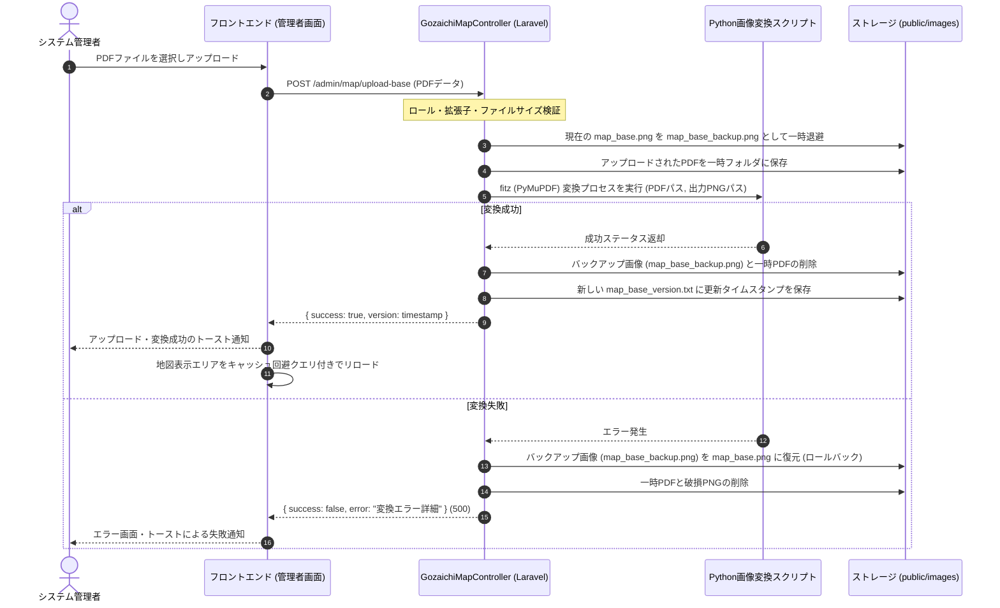

# ベースマップPDFアップロード・自動変換機能 実装計画書

本計画書は、管理者画面から地図のベースPDFをアップロードし、自動的に地図背景画像（PNG）を差し替える機能の実装ステップを定義する。プログラムの実装自体は行わず、設計・計画のみを提示する。

---

## 1. システム構成・処理フロー



---

## 2. 影響コンポーネントと実装ステップ

### ステップ 1: ルーティングとアクセス権限定義
* **[routes/web.php](file:///opt/project/syukuba-executive-committee/routes/web.php) の更新**:
  - 管理者専用ルートグループ（ミドルウェア `auth` & ロール制限 `admin`）配下に、アップロード用のルートを追加する。
  ```php
  Route::post('/admin/map/upload-base', [GozaichiMapController::class, 'uploadBaseMap'])
      ->name('admin.map.uploadBase');
  ```

### ステップ 2: コントローラのアクション実装
* **[GozaichiMapController.php](file:///opt/project/syukuba-executive-committee/app/Http/Controllers/GozaichiMapController.php) へのメソッド追加**:
  - `uploadBaseMap(Request $request)` メソッドを追加。
  ```php
  public function uploadBaseMap(Request $request) {
      // 1. システム管理者ロール（admin）の権限チェック
      $this->checkAdminPermission(); // 管理者権限チェック用ヘルパー

      // 2. バリデーション
      $request->validate([
          'map_pdf' => ['required', 'file', 'mimes:pdf', 'max:10240'], // 最大10MBのPDFのみ
      ]);

      $pdfFile = $request->file('map_pdf');
      $basePath = public_path('images');
      $targetPng = $basePath . '/map_base.png';
      $backupPng = $basePath . '/map_base_backup.png';
      
      // 3. バックアップ作成
      if (file_exists($targetPng)) {
          copy($targetPng, $backupPng);
      }

      // 4. アップロードされたPDFの一時保存
      $tempPdfPath = $pdfFile->getRealPath();

      try {
          // 5. Python 変換プロセスの実行
          // Symfony\Component\Process\Process を使用してバックグラウンドでスクリプトを実行
          $process = new Process([
              'python3', 
              base_path('scripts/convert_pdf_to_base.py'), 
              $tempPdfPath, 
              $targetPng
          ]);
          $process->run();

          if (!$process->isSuccessful() || !file_exists($targetPng) || filesize($targetPng) === 0) {
              throw new \Exception('PDFからPNGへの変換プロセスに失敗しました: ' . $process->getErrorOutput());
          }

          // 成功時: バックアップの削除とバージョンタイムスタンプの更新
          if (file_exists($backupPng)) {
              unlink($backupPng);
          }
          
          $timestamp = time();
          file_put_contents($basePath . '/map_base_version.txt', $timestamp);

          return response()->json(['success' => true, 'version' => $timestamp]);

      } catch (\Exception $e) {
          // 失敗時: ロールバック処理
          if (file_exists($backupPng)) {
              rename($backupPng, $targetPng); // バックアップを元に戻す
          }
          Log::error('ベースマップPDFアップロード・変換失敗: ' . $e->getMessage());
          return response()->json(['success' => false, 'error' => $e->getMessage()], 500);
      }
  }
  ```

### ステップ 3: PDF変換用 Python スクリプトの配置
* **`scripts/convert_pdf_to_base.py` の新規作成**:
  - 引数として `input_pdf_path` と `output_png_path` を受け取り、PyMuPDF (fitz) を用いて 1600px 幅にレンダリングする。
  ```python
  import fitz
  import sys

  if len(sys.argv) < 3:
      print("Usage: python3 convert_pdf_to_base.py <input_pdf> <output_png>")
      sys.exit(1)

  input_pdf = sys.argv[1]
  output_png = sys.argv[2]

  try:
      doc = fitz.open(input_pdf)
      page = doc[0] # 1ページ目のみ対象
      
      # 横幅を 1600px 相当にするズーム倍率を計算
      original_w = page.rect.width
      zoom = 1600.0 / original_w
      matrix = fitz.Matrix(zoom, zoom)
      
      pix = page.get_pixmap(matrix=matrix)
      pix.save(output_png)
      print("Success")
      sys.exit(0)
  except Exception as e:
      print(f"Error: {str(e)}")
      sys.exit(1)
  ```

### ステップ 4: フロントエンド UI の追加 (管理者設定画面)
* **[index.blade.php](file:///opt/project/syukuba-executive-committee/resources/views/goza/map/index.blade.php) へのアップロード機能の追加**:
  - 管理者 (`canEdit` & `auth()->user()->isSystemAdmin()`) の場合にのみ、ベースマップ差し替え設定用のアップロードモーダルを表示するボタンを追加。
  - ドラッグ＆ドロップ対応のファイルドロップゾーンと進捗ローディング表示をモーダル内に実装。
  - AJAX 経由でファイルを送信し、完了時はページの地図画像をタイムスタンプ付きURLでリロードする。
  ```javascript
  // キャッシュ回避用の画像パス更新
  const mapElement = document.getElementById('mapImage'); // または #mapWrapper
  mapElement.style.backgroundImage = `url('/images/map_base.png?v=${res.version}')`;
  ```

---

## 3. 検証・品質確保計画

### 3.1 整合性チェック
- 変換処理終了後に、出力PNGが本当に作成されているか、かつファイルサイズが正常（例: 20KB以上）であるかをコントローラ側で検証。

### 3.2 セキュリティ対策
- 拡張子の検証だけでなく、MIMEタイプが `application/pdf` であるかの厳密なチェック。
- `isSystemAdmin()` による完全なアクセス拒否（一般ユーザーや、幹事でも管理者でない場合はルートアクセス時点で `403` 制限）。

### 3.3 ロールバック自動テスト
- 破損したダミーPDFをアップロードした際に、変換がエラーとなって自動で以前の `map_base.png` が復帰することをPHPUnit統合テストで担保する。
