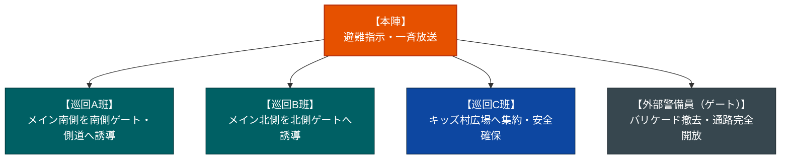

# 保土ケ谷宿場まつり 警備巡回計画書

本計画書は、2日間にわたり開催される「保土ケ谷宿場まつり」において、来場者の安全確保、雑踏事故の防止、および新規設置される「キッズ村」を含む飛び地・導線エリアでの安全対策を行うための巡回警備計画です。

---

## 1. 警備基本情報

| 項目 | 詳細内容 |
| :--- | :--- |
| **対象エリア** | ①メイン通り 約300メートルの直線道路（通行止め・歩行者天国）<br>②北側ゲート～キッズ村 約100メートルの裏路地（**通行止めではない**）<br>③小学校跡地（キッズ村） |
| **開催日程** | 2日間 |
| **警備時間** | 各日 11:00 ～ 17:00（主催者警備員の配置は 10:00 ～ 17:30） |
| **想定来場者数** | 約10,000人 / 日（うち、家族連れの多くがキッズ村へ移動と想定） |
| **エリア特性** | メイン通り（両端に北側ゲート・南側ゲートを設置）の両脇には出店が密集。裏路地は車両が通行するため注意が必要。 |
| **混雑ピーク** | お昼前後（11:30 ～ 13:30） |
| **統括拠点** | **本陣**（メイン通り中央付近に設営） |

---

## 2. 警備基本方針
1. **本陣を中心とする情報の一元管理**: 飛び地（キッズ村）とメイン通りの状況を本陣でリアルタイムに集約。
2. **裏路地における交通事故防止**: 通行止めではない裏路地（100m）において、歩行者（特に児童・幼児）と車両の接触事故を防ぐための警戒・誘導。
3. **北側・南側ゲートとのスムーズな連携**: 外部委託の各ゲートと連携し、不審者対策や緊急車両の動線確保を行う。

---

## 3. 人員配置および配置図

メイン通りの両端である「北側ゲート」と「南側ゲート」の通行規制・誘導は、外部の警備保障会社へ委託します。
主催者側の警備人員（計8名または10名）は、本陣・救護・巡回に集中して配置します。

### 【推奨案】増員配置（主催者側：計10名）
※安全確保を最優先とし、キッズ村と裏路地専用の巡回班を新設します。
* **本陣（統括拠点）**: 2名（指揮、連絡担当）
* **救護班（救護所常駐）**: 2名（救護処置、本陣指示による出動）
* **メイン通り巡回（A班・B班）**: 4名（2名1組 × 2個班。本陣を境に南側・北側を分担）
* **キッズ・裏路地巡回（C班）**: 2名（1組）
  * 北側ゲート ⇆ 裏路地 ⇆ キッズ村を常時往復。裏路地での車輛注意喚起とキッズ村内の安全監視。

### 【現状維持案】人員スプリット配置（主催者側：計8名）
※予算制限等で増員が難しい場合、メイン通りの巡回を減らし、キッズ村側に人員を割きます。
* **本陣 / 救護班**: 各2名（計4名）
* **メイン通り巡回（A班）**: 2名（1組で南側ゲート〜北側ゲート全域をカバー）
* **キッズ・裏路地巡回（C班）**: 2名（1組で裏路地・キッズ村をカバー）

### エリアおよび巡回配置図

```mermaid
graph TD
    subgraph MainStreet ["メイン通り（約300m・歩行者天国）"]
        GateN["【北側ゲート（メイン通り北端）】<br>(外部警備会社)"]
        Honjin["【本陣】<br>(統括拠点)"]
        GateS["【南側ゲート（メイン通り南端）】<br>(外部警備会社)"]
        
        GateN <-->|B班巡回| Honjin
        Honjin <-->|A班巡回| GateS
    end
    
    Kids["【キッズ村】 小学校跡地<br>(C班が巡回警戒)"] <-->|導線: 裏路地 約100m<br>(C班が往復巡回 / 車両通行あり)| GateN

    %% 高コントラスト・高視認性スタイル設定
    style Honjin fill:#E65100,stroke:#BF360C,stroke-width:2px,color:#ffffff
    style Kids fill:#0D47A1,stroke:#0A2540,stroke-width:2px,color:#ffffff
    style GateN fill:#37474F,stroke:#263238,stroke-width:2px,color:#ffffff
    style GateS fill:#37474F,stroke:#263238,stroke-width:2px,color:#ffffff
```

---

## 4. 裏路地（導線）およびキッズ村の警戒対策

> [!WARNING]
> **裏路地（非通行止め区間）での車両対策**
> * 巡回C班は、裏路地を歩行する子どもたちが車道に広がらないよう声かけ（「端を歩いてね」等）を行う。
> * 車両進入時には、歩行者を一時的に道の端に寄せ、車両に対しては最徐行を促すジェスチャー等で安全に通過させる。
> * 特に混雑ピーク時の「キッズ村への行き来」が増える時間帯は、裏路地の中間付近での監視を強める。

---

## 5. 巡回方法および各班の動線

### 巡回ルートの設定
* **巡回A班**: 本陣 ⇆ 南側ゲート（メイン通り南端）を往復。
* **巡回B班**: 本陣 ⇆ 北側ゲート（メイン通り北端）を往復。
* **巡回C班**: 北側ゲート ⇆ 裏路地 ⇆ キッズ村を往復。
* ※本陣・北側ゲートをそれぞれの基点として動線を明確に分け、役割の重複を防ぎます。

---

## 6. 連絡体制（トランシーバー以外の代替プラン）

飛び地（100m先）があり、裏路地や校舎の影による電波遮蔽が懸念されるため、トランシーバー（特定小電力）以外のプランを以下に提示します。

### プランA：スマートフォンIP無線アプリの活用（強く推奨）
手持ちのスマートフォンに専用アプリをインストールし、有線またはBluetoothのイヤホンマイクを使用します。
* **推奨アプリ例**: Buddycom（バディコム）、Aldio（アルディオ）、LiME（ライム）など
* **メリット**:
  * 携帯電話回線（4G/5G）を使用するため、100m離れたキッズ村や裏路地、建物内でも**電波遮蔽がなくクリアに通話可能**。
  * ボタンを押すだけで全員に一斉音声送信（トランシーバーと同等の操作感）。
  * テキストチャットや、現場写真（迷子、路地でのトラブル状況）の送信、GPSによる巡回員の位置特定も可能。
* **デメリット**: データ通信量とスマートフォンのバッテリー消費があるため、モバイルバッテリーの携行が必須。

### プランB：ビジネスチャット（LINE / Slack / Discord）の常時グループ通話
無料かつ既存のツールを利用する、コストを抑えたプランです。
* **システム**: 「LINE」等のグループ通話機能を利用し、イヤホンを装着して常時通話状態にする。
* **メリット**:
  * 追加の専用機器や有料アプリ契約が不要（低コスト）。
  * 現場の写真や位置情報を即座に共有可能。
* **デメリット**:
  * 混雑時に携帯回線が混み合うと、通話品質の低下や切断が発生しやすい。
  * 常時接続によるバッテリー消費が極めて激しい。

---

## 7. 緊急時対応手順

### 連絡系統およびエスカレーションフロー

```mermaid
graph TD
    Honjin["【本陣】<br>(統括・情報集約)"] <-->|連絡ツール (一斉通話)| PatA["巡回A班<br>(メイン南)"]
    Honjin <-->|連絡ツール (一斉通話)| PatB["巡回B班<br>(メイン北)"]
    Honjin <-->|連絡ツール (一斉通話)| PatC["巡回C班<br>(キッズ・裏路地)"]
    Honjin <-->|連絡ツール (一斉通話)| Aid["救護班<br>(救護所常駐)"]
    
    Honjin <-->|ホットライン| SecCompany["外部警備会社 現場責任者<br>(北側・南側ゲート窓口)"]
    Honjin <-->|緊急通報| External["警察・消防・救急車"]

    %% 高コントラスト・高視認性スタイル設定
    style Honjin fill:#E65100,stroke:#BF360C,stroke-width:2px,color:#ffffff
    style PatA fill:#006064,stroke:#00363a,stroke-width:2px,color:#ffffff
    style PatB fill:#006064,stroke:#00363a,stroke-width:2px,color:#ffffff
    style PatC fill:#0D47A1,stroke:#0A2540,stroke-width:2px,color:#ffffff
    style Aid fill:#1B5E20,stroke:#0D1F0D,stroke-width:2px,color:#ffffff
    style SecCompany fill:#37474F,stroke:#263238,stroke-width:2px,color:#ffffff
    style External fill:#B71C1C,stroke:#7F0000,stroke-width:2px,color:#ffffff
```

---

## 8. トラブル別対処マニュアル（サンプル）

有事の際、現場の警備員および本陣がとるべき具体的なアクションと関係機関の連絡先です。

### 1. 迷子（児童・高齢者）の発生・保護
* **現場の対応**: 
  * 迷子らしき人物を見かけた、または保護者から申告があった場合、その場で名前・年齢・服装・特徴を確認。
  * 本陣へ連絡し、特徴を共有。自力で探さず、原則として対象者を**本陣（または本陣迷子係）**へ同伴・保護する。
  * 本陣は各巡回班に特徴を周知し、必要に応じて会場内アナウンスを行う。
* **連絡先**:
  * **本陣（迷子保護担当）**: `090-XXXX-XXXX`（サンプル）
  * **保土ケ谷警察署（迷子届）**: `045-335-0110`（代表）

### 2. 急病者・負傷者の発生（熱中症、転倒など）
* **現場の対応**:
  * 意識と呼吸の有無を確認。大声で周囲に協力を求め、本陣へ「発生場所」「症状」を即時報告。
  * 意識がある場合は日陰の安全な場所へ移動させ、水分補給等の応急処置を行う。
  * 意識がない、または重傷の場合は、本陣へ119番通報および救護班の急行を要請。
* **連絡先**:
  * **救護所（救護班携帯）**: `090-YYYY-YYYY`（サンプル）
  * **消防署（救命救急）**: `119`（本陣が通報）
  * **保土ケ谷消防署（代表）**: `045-331-0119`（お問い合わせ・事前調整用）

### 3. 出店での火災発生
* **現場の対応**:
  * 「火事だ！」と大声で叫び周囲に知らせ、近くの出店に配備されている消火器を借りて初期消火。
  * 本陣へ「発生場所（店名・番号）」を即時報告。
  * 出店者に「プロパンガス・電気・火気の即時停止」を命じる。
  * 消火が困難な場合、直ちに初期消火を断念し、来場者を火元から遠ざけ、南北のゲートおよび側道へ避難誘導する。
* **連絡先**:
  * **消防署（火災通報）**: `119`（即時通報）
  * **本陣（緊急指揮）**: `090-XXXX-XXXX`（サンプル）

### 4. 喧嘩・暴行・盗難（スリ）等のトラブル・不審者
* **現場の対応**:
  * 喧嘩等が発生した場合、警備員自身が当事者の間に割って入るなど直接的な介入は行わず、身の安全を確保する。
  * 速やかに本陣へ「発生場所」「当事者の特徴・人数」「武器の有無」を報告し、警察への通報を要請する。
  * 警察が到着するまで、第三者の巻き込み防止と、可能であれば状況の撮影・記録を行う。
* **連絡先**:
  * **警察署（事件通報）**: `110`（即時通報）
  * **保土ケ谷警察署（代表）**: `045-335-0110`

### 5. 不審物の発見（放置バッグ、不審な箱など）
* **現場の対応**:
  * **絶対に触らない、動かさない。**
  * 本陣へ「発見場所」「形状・大きさ」「煙や臭いの有無」を報告。
  * 不審物の周囲およそ10m〜20mを立ち入り禁止区域にし、来場者を遠ざける。
  * 本陣は警察へ通報し、指示を仰ぐ。
* **連絡先**:
  * **警察署（不審物通報）**: `110`

### 6. 車両の誤進入（裏路地などからの侵入）
* **現場の対応**:
  * 規制エリア内に一般車両が入ってきた場合、警備員は直ちに車両を安全に停止させる。
  * 運転手に「ここはまつり用の通行止め規制区間である」ことを告げ、安全を確認しながらバック等で規制エリア外（裏路地の交差点外など）へ退出するよう促す。
  * 運転手が指示に従わない、または無理に進入しようとする場合は、速やかに本陣へ報告し、外部警備会社および警察へ連携する。
* **連絡先**:
  * **外部警備会社現場責任者**: `090-ZZZZ-ZZZZ`（サンプル）
  * **本陣（緊急指揮）**: `090-XXXX-XXXX`
  * **保土ケ谷警察署（代表）**: `045-335-0110`

### 7. 地震の発生（自然災害）
* **現場の対応**: 
  * 来場者に対し、「落ち着いてその場にかがむ」「出店のテント、看板、商品、電柱などから離れる（頭部を保護する）」よう大声で呼びかける。
  * 出店者に対し、二次災害（火災・ガス漏れ）防止のため、コンロやガスボンベの即時消火・バルブ閉鎖を指示する。
  * 揺れが収まり次第、本陣から全体の被害状況の報告およびイベント継続・中止の指示を受ける。
  * 中止・避難指示が出た場合、本陣が指定する一時避難場所（サンプル：小学校跡地「キッズ村」グラウンド、または近隣の「保土ケ谷小学校」）へ、パニックを防ぐため「歩いて避難する」よう来場者を落ち着かせて誘導する。
* **連絡先**:
  * **本陣（災害対策本部）**: `090-XXXX-XXXX`
  * **保土ケ谷区役所（地域防災担当）**: `045-334-6262`（代表）
  * **横浜市 災害不要ダイヤル**: `045-671-4410`

### 8. 突風・強風・ゲリラ雷雨の発生（自然災害）
* **現場の対応**:
  * 各出店に対し、テントのウエイト（重り）の補強、飛びやすいのぼり旗・看板などの即時撤去・固定を指示する。
  * 来場者に対し、テントの倒壊や飛来物から身を守るため、頑丈な建物内や本陣テントなどへ一時避難するよう促す。
  * 雷が発生している場合、木の下や金属製のポール、テントの骨組みの近くから速やかに離れるよう誘導する。
  * 本陣は気象警報（竜巻注意情報、雷注意報等）を随時監視し、一時中断や中止の判断を各班に伝達する。
* **連絡先**:
  * **本陣（気象情報監視）**: `090-XXXX-XXXX`

---

## 9. 緊急避難誘導計画

大規模な地震、火災、その他の緊急事態によりイベントの継続が不可能となり、会場からの避難が必要となった場合の誘導手順です。

### 1. 避難誘導の基本原則
* **パニック防止（落ち着いたアナウンス）**:
  * メガホンや拡声器を用い、低く落ち着いた声で指示を行います。「走らない」「押さない」「戻らない」を徹底させます。
* **一方通行の回避（分散避難）**:
  * 直線300mのメイン通りに滞留した約1万人の来場者が一方向に殺到すると雑踏事故（将棋倒し）が発生します。南側ゲート・北側ゲートへの分散誘導に加え、あらかじめ確認された側道（横の路地）へ流すよう誘導します。
* **一時避難場所（キッズ村・小学校跡地）の活用**:
  * 小学校跡地（キッズ村）は広いグラウンドを有するため、メイン通りの過密を緩和する「一時避難場所」として有効に活用します。

### 2. 班別の避難誘導ルートと役割分担

避難指示が発令された際、各班は担当エリアの来場者を以下のように誘導します。



* **本陣（統括指揮者）**:
  * 拡声器等を用いて「訓練（または緊急避難）です。落ち着いて係員の指示に従ってください」と放送。
  * 外部警備会社へ「ゲートA・Bのバリケードを直ちに全面撤去し、避難通路を完全開放せよ」と指示。
* **巡回A班（担当：本陣〜南側ゲート）**:
  * 本陣より南側にいる来場者を**「南側ゲート」**へ誘導。また、メイン通りに接続する安全な側道へと誘導し、密集度を下げます。
* **巡回B班（担当：本陣〜北側ゲート）**:
  * 本陣より北側にいる来場者を**「北側ゲート」**へ誘導。北側ゲートから裏路地へ流れる群衆が滞留しないよう、ゲート付近での立ち止まりを防ぎます。
* **巡回C班（担当：キッズ村・裏路地）**:
  * キッズ村（小学校跡地）にいる来場者を校舎から離れた**「跡地グラウンド中央」**に集約し、落下物のない安全なエリアで一時待機させます。
  * 北側ゲートから裏路地を通って避難してくる来場者をスムーズに小学校跡地内へ受け入れます。
* **救護班（担当：救護所周辺）**:
  * 動けないケガ人や体調不良者を優先的に避難させるほか、以下に示す「要配慮者」のサポートを行います。

### 3. 災害時要配慮者の支援
* **対象者**: 乳幼児連れ（ベビーカー利用）、高齢者、車椅子利用者、妊婦、外国人など。
* **警備員のアクション**:
  * 巡回中および誘導中、要配慮者を発見した場合は個別に声をかけ、優先的に避難経路へ案内します。
  * 車椅子の段差越えや、ベビーカーの移動の補助を行い、自力避難が困難な場合は直ちに本陣へ救護応援を要請します。
  * 外国人の来場者に対しては、ジェスチャーや多言語カード（英語・中国語等の避難指示ボード）を用い、視覚的に避難方向を指し示します。
